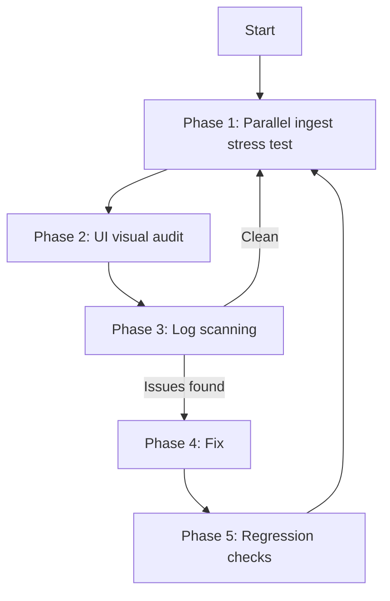

# InsightNote Overnight Testing Loop

Use when running extended test cycles to stress-test parallel ingestion, audit UI behavior, and verify zero regression.

**Setup:** [docs/SETUP.md](../../docs/SETUP.md)

---

## Loop architecture



---

## Phase 1: Parallel ingestion

1. Start services:
   ```bash
   scripts/run-dev.bat
   # or: docker compose up -d postgres mongodb neo4j qdrant
   # then: conda activate gpu_env && cd backend && python server.py
   # then: cd frontend && npm run dev
   ```

2. At http://localhost:3000, submit concurrently:
   - Multiple URLs via URL form
   - Multiple text notes
   - Multiple PDF uploads (drag-and-drop)

3. Verify:
   - All sources appear in sidebar with `processing` status
   - Pipeline progress updates in parallel
   - No `attached to a different loop` errors in `backend/logs/server.log`
   - Jobs transition to `ready` without server crash

---

## Phase 2: UI visual audit

Navigate to http://localhost:3000 and verify:

| Check | Expected |
|---|---|
| Pending chat state | 3 bouncing dots in assistant bubble (left-aligned) |
| Query graph highlight | Cyan glow on reasoning path nodes/links |
| Ingest graph highlight | Emerald glow on new nodes after source `ready` |
| Dimming | Non-path nodes dimmed during active highlight |
| Reset View | All highlights and particles cleared immediately |
| Streaming cursor | Pulsing indigo bar during answer stream |
| Citations | Cards below answer — no raw `doc-` / `chunk-` IDs |
| Progress labels | User-friendly stages, no file paths or internal IDs |

Screenshot reference images exist at:
- `docs/images/workspace_viewport.png`
- `docs/images/dashboard_viewport.png`

---

## Phase 3: Log scanning

Check `backend/logs/server.log` (last ~200 lines) for:

- `Traceback` / unhandled `Exception`
- `attached to a different loop`
- Repeated connection failures to Mongo/Neo4j/Qdrant/Postgres

Check browser console for failed `/api/*` requests.

Record findings in `backend/logs/overnight_bug_report.md` if needed.

---

## Phase 4: Fix loop

Group issues by domain:

| Domain | Files |
|---|---|
| RAG / async | `backend/app/core/zerag.py`, `operate.py`, `utils.py` |
| API routes | `backend/app/api/routers/insightnote_routes.py` |
| WebGL / UI | `frontend/src/components/graph/KnowledgeGraphPanel.tsx` |
| Chat / citations | `frontend/src/components/chat/ChatPanel.tsx` |
| API broker | `frontend/src/lib/api.ts` |

Respect [AGENTS.md](../../AGENTS.md) rules:
- Cyan for query highlights, emerald for ingest
- Call `fgRef.current.refresh()` on highlight changes
- Strip internal IDs from all user-facing output

---

## Phase 5: Regression checks

All must pass before starting the next cycle:

```bash
# Frontend
cd frontend && npm run build

# Backend (gpu_env required)
conda activate gpu_env
cd backend && pytest tests/ -v
```

Or from project root:
```bash
task test:all
task app:lint-frontend
```

> Note: `scripts/verify_backend_pipeline.py` is not in the repo. Use pytest as the E2E gate.

If any step fails, return to Phase 4.

---

## Graph highlight reference

| Mode | Color | Trigger |
|---|---|---|
| `query` | `#38bdf8` (cyan) | Chat response `graph_path` |
| `ingest` | `#10b981` (emerald) | Source reaches `ready` |

Do **not** use orange-gold — that was the old color scheme.
