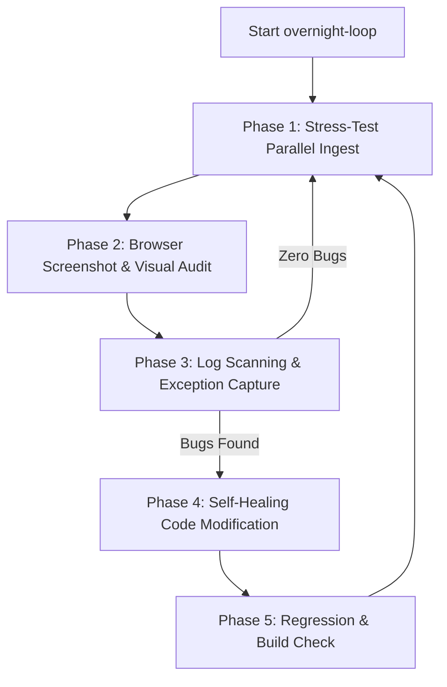

# InsightNote Overnight Continuous Testing & Self-Healing Loop

Use this skill when the Master Architect requests an automated, overnight continuous run to stress-test, capture screenshots, audit the UI/UX, and automatically heal (fix) any bugs found in the InsightNote workspace.

This workflow utilizes the power of **Multi-Agent Parallel Delegation** and **Automated Browser Automation** to run infinite test-and-repair cycles.

---

## 🔄 The Overnight Testing & Self-Healing Loop Architecture

The overnight agent operates in an infinite, self-driving loop consisting of 5 progressive phases:



---

## 🛠️ Step-by-Step Overnight Execution Guide

### 🚀 Phase 1: Stress-Test Parallel Ingestion (Concurrency Audit)
The agent will test the asyncio concurrency and loop boundaries by queuing dozens of files, notes, and URLs simultaneously.

1.  **Start Services**: Ensure databases are up-to-date and clean:
    ```bash
    scripts/run-dev.bat
    ```
2.  **Concurrency Ingestion**: Use Playwright/Browser tools to log into `http://localhost:3000/` and rapidly submit:
    *   10+ URLs (using the URL submission form).
    *   10+ Txt Notes (using the rich note editor).
    *   10+ PDF files (using the drag-n-drop file uploader).
3.  **Validate Concurrency**: Ensure all sources enter the sidebar list concurrently, progress percentages update in parallel, and no `attached to a different loop` or `WinError 1225` crashes occur in the backend logs.

---

### 📸 Phase 2: Browser UI/UX Screenshot & Accessibility Audit
The agent will perform visual and structural audits to ensure the 3D Graph and Chat console look premium, elegant, and modern.

1.  **Access the Workspace**: Navigate to the active workspace on the local Vite dev server:
    ```typescript
    await page.goto("http://localhost:3000/");
    ```
2.  **Take Screen Snapshots**: Take full-page and element-specific screenshots of the active columns to verify layout:
    ```typescript
    await page.screenshot({ path: "backend/logs/ui_workspace_viewport.png", fullPage: true });
    ```
3.  **Audit Visual Elements**:
    *   **Bouncing Dots State**: Ensure the compact assistant welcome bubble with 3 bouncing dots renders perfectly at the left side, and no blocky placeholders are shown.
    *   **Glowing Paths**: Submit a chat query, let it stream, and verify that focused nodes and links glow beautifully in neon sky-blue while unselected nodes are dimmed.
    *   **Unfocus Effect**: Click "Reset View" or submit a new query and verify that previous paths and particles immediately unfocus and disappear.
4.  **Accessibility & Performance Audit**: Run a Lighthouse audit to capture SEO, best practices, and accessibility score reports:
    ```json
    { "mode": "navigation", "device": "desktop" }
    ```

---

### 🔍 Phase 3: Log Scanning & Exception Capture (Bug Discovery)
The agent will read the server logs and browser console logs to discover any silent or critical exceptions.

1.  **Read Backend Logs**: Retrieve the latest 200 lines from `backend/logs/server.log`. Search for:
    *   `Traceback` or `Exception`
    *   `attached to a different loop` (asyncio loop mismatch)
    *   `RuntimeError` / `KeyError` / `AttributeError`
2.  **Read Browser Console Logs**: Call `getConsoleErrors` and `getNetworkErrors` to capture any failed API requests or runtime JavaScript errors.
3.  **Log Discovery File**: Record any discovered bugs inside `backend/logs/overnight_bug_report.md` with:
    *   Bug description
    *   Relevant stack trace / console log
    *   Severity level (LOW, MEDIUM, HIGH, CRITICAL)

---

### 🩹 Phase 4: Self-Healing & Visual Upgrades (Automated Code Fixes)
When a bug is discovered or a visual element is flagged as "phèn" (not premium), the agent will spawn **parallel sub-agents** to fix them.

1.  **Decompose the Problem**: Group bugs by domain:
    *   *Domain A (Core RAG & Async)* -> Assign sub-agent to edit `backend/app/core/utils.py` or `zerag.py`.
    *   *Domain B (API Contracts)* -> Assign sub-agent to edit `backend/app/api/routers/`.
    *   *Domain C (WebGL & Tailwind UI)* -> Assign sub-agent to edit `frontend/src/components/` and optimize CSS classes.
2.  **Spawn Parallel Repair Agents**: Use `spawn_agent` in parallel with distinct, disjoint write directories to implement surgical fixes:
    ```json
    {
      "label": "Fixing Event Loop Mismatch",
      "message": "Analyze backend/logs/overnight_bug_report.md and fix the asyncio loop mismatch in backend/app/core/utils.py."
    }
    ```
3.  **Tailwind Class Tweaking**: Improve visual premiumness by updating component styles with:
    *   High-contrast neon glows (`shadow-[0_0_15px_rgba(99,102,241,0.2)]`).
    *   Glassmorphism blur panels (`backdrop-blur-md bg-slate-950/40 border-slate-900/60`).
    *   Gentle transitional slide-ins (`animate-slide-up`, `animate-fade-in`).

---

### 🧪 Phase 5: Regression Testing & Build Verification
The agent will verify that the fixes didn't break compilation or existing features.

1.  **Run Frontend Compilation**: Ensure TypeScript type-safety compiles cleanly:
    ```bash
    cd frontend && npm run build
    ```
2.  **Run Backend pytest**: Ensure unit and integration tests pass cleanly:
    ```bash
    cd backend && pytest -v
    ```
3.  **Run Pipeline E2E Verification**: Ensure the core multimodal indexing pipeline operates perfectly:
    ```bash
    C:/Users/nguye/anaconda3/envs/gpu_env/python.exe scripts/verify_backend_pipeline.py
    ```

If any step fails, return to **Phase 4** and continue the repair loop. If all verification steps pass, record the success in `backend/logs/overnight_run_log.txt` and start the next stress-test cycle!
