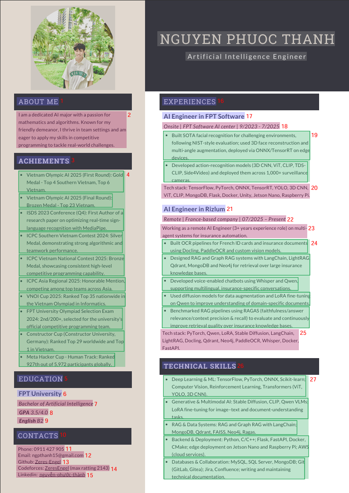
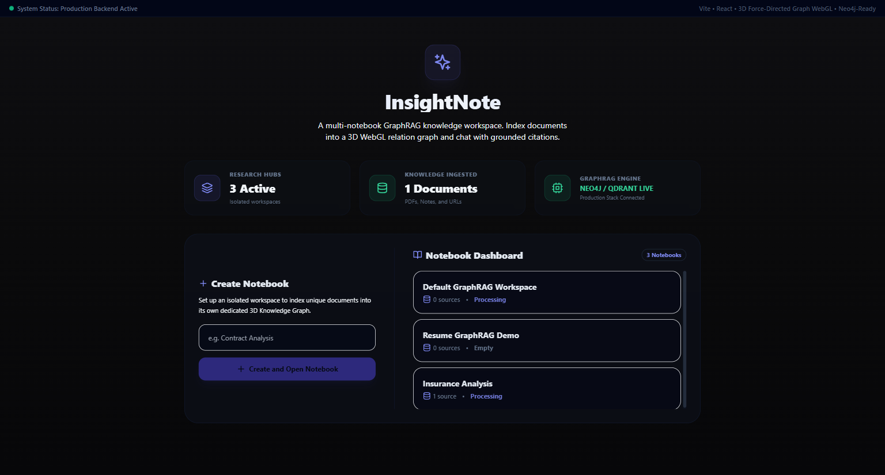
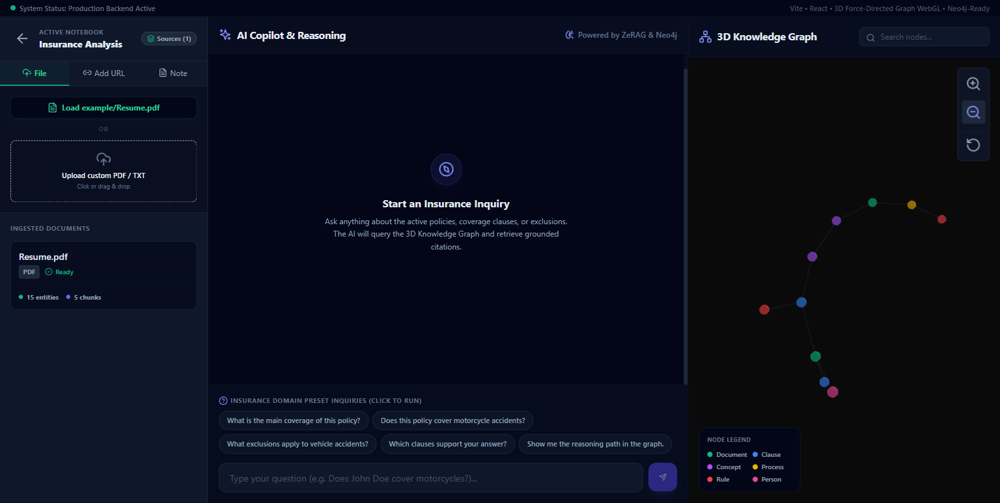
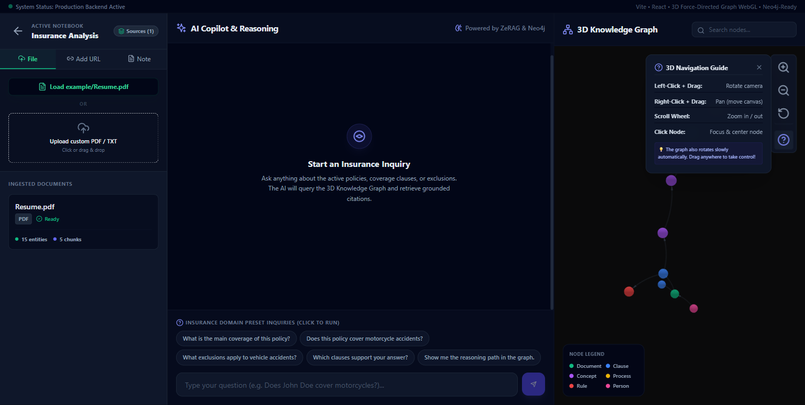
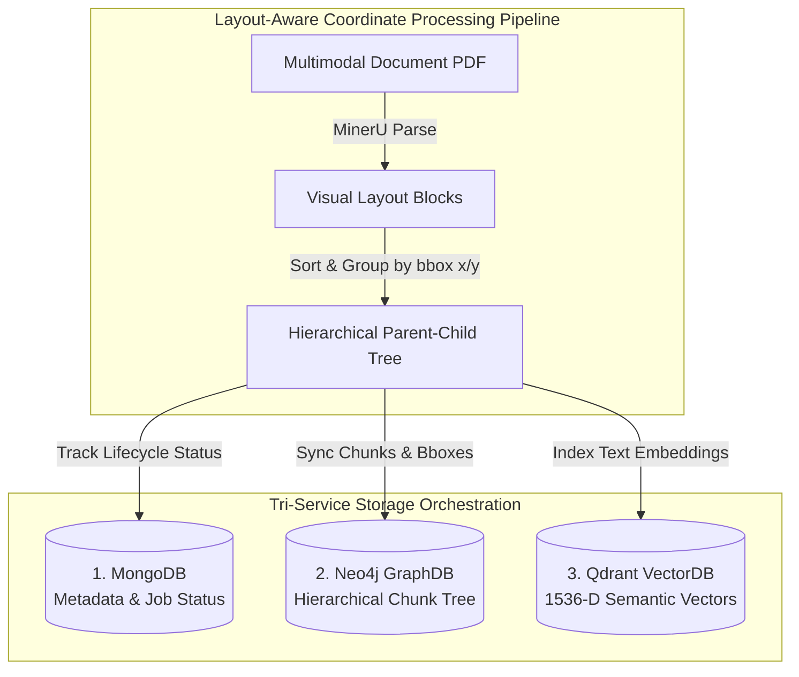

# 🎨 InsightNote — Connected GraphRAG Knowledge Workspace

> Transform documents into connected knowledge.

InsightNote is not a ChatPDF clone. It is a **NotebookLM-style knowledge workspace** with a three-column interface combining **Hybrid GraphRAG**, **collapsible retrieval steps**, and a **live 3D force-directed knowledge graph** visualization.

Developed using your existing high-performance **ZeRAG** (Zero-effort Retrieval-Augmented Generation) engine, InsightNote combines **Neo4j** (Knowledge Graph), **Qdrant** (Vector Database), **MongoDB** (Metadata store & LLM cache), and **FastAPI** with a **React + TypeScript + Tailwind + WebGL (react-force-graph-3d)** frontend.

---

## 📸 Visual Previews

### 1. Live Progressive Document Ingestion (Demo Thumbnail)
Watch the pipeline parse layout blocks, perform chunking, extract semantic entities and relationships, and index them into Neo4j and Qdrant in real-time.


### 2. Layout-Aware Multimodal Processing
InsightNote parses complex layouts (multi-column text, tables, and sections) with sub-pixel coordinate precision (`bbox` coordinates) using MinerU to construct hierarchical knowledge representations.


### 3. Redesigned Glassmorphic Dashboard
Our premium landing dashboard provides clear, high-tech metrics summarizing Active Notebooks, Ingested Documents, and Live Database sync metrics.


### 4. The 3-Column Interactive Workspace
Ingest files on the left, Q&A with conversational LLM reasoning in the middle, and watch your 3D Knowledge Graph uon-luon (curve and glow) on the right!


### 5. Interlocking 3D Navigation Guide
Rotate, Pan, Zoom, and click nodes smoothly while taking advantage of our helpful built-in navigation guide overlay.


---

## 🚀 Key Features

*   **Left Column (Sources / Notebook Panel)**:
    *   Add URLs (with automated server-side scraping).
    *   Add raw Text Notes (saved and indexed in the background).
    *   PDF Drag & Drop or file upload (processed by the real MultiRAG OCR/MinerU parser pipeline).
    *   **Delete Document 🆕**: Click the red trash icon next to any document to cleanly remove it from the index list (and databases).
    *   Source index displaying document names, ingest status, and graph metadata (e.g. entity & chunk count).
*   **Middle Column (ChatGPT-style Chat & Copilot)**:
    *   Responsive chat thread with streaming capabilities and markdown rendering.
    *   **Real LLM & RAG query integration 🆕**: All preset queries and custom messages are fed directly into the live LLM + ZeRAG engine for a fully dynamic query experience.
    *   **Grounded Citations**: Source cards appear below answers, showing exactly where facts are retrieved from.
    *   **Collapsible Retrieval Steps**: Explains precisely what the GraphRAG pipeline did (entity lookups, semantic connections found, vector search results, and reranking thresholds).
    *   **Preset Demo Pills**: 5 preloaded insurance-domain questions to showcase the full GraphRAG traversal in 5 seconds.
*   **Right Column (Knowledge Graph Panel)**:
    *   **3D WebGL Force Graph**: Fully interactive, panning, zooming, and dragging.
    *   **Auto slow-rotation camera 🆕**: Mapped using native ThreeJS OrbitControls to rotate the graph slowly in 3D space to provide a live, dynamic presentation.
    *   **ResizeObserver Integration 🆕**: Auto-resizes the 3D canvas dynamically to its parent column width, centering all nodes perfectly inside the visible panel area.
    *   **Active Traversal Highlighting**: Asking a question highlights the exact retrieval path in gold/orange. Non-path nodes are dimmed, and light particles animate down relationships!
    *   **Properties Inspector**: Clicking a node slides up a properties tray displaying custom JSON attributes.
    *   **Live Search**: Instantly find nodes and focus the 3D camera onto them.

---

## 🏗 Three-Column Layout

```txt
┌──────────────────────────────────────────────────────────────────────────────┐
│ InsightNote                                      Workspace: Insurance Demo    │
├───────────────────────┬─────────────────────────────────┬────────────────────┤
│ Sources               │ Ask InsightNote                  │ Knowledge Graph    │
│                       │                                 │                    │
│ Add URL               │ ChatGPT-style messages           │ 3D Neo4j Graph     │
│ Add Text Note         │ Citations                        │                    │
│ Upload PDF            │ Retrieval steps                  │ Highlighted path   │
│ Trash bin (Delete)    │ Composer                         │ Node details       │
│                       │                                 │ Navigation Guide   │
└───────────────────────┴─────────────────────────────────┴────────────────────┘
```

---

## 🌳 Advanced Core Architecture: Layout-Aware Parsing & Hierarchical Chunking

Unlike traditional naive character-splitting RAG systems, InsightNote models documents as highly structured **Hierarchical Knowledge Trees** utilizing sub-pixel visual coordinate bounding boxes (`bbox`) extracted via **MinerU**.



### 💎 Key Architectural Breakthroughs:
1.  **Coordinate-Based Bounding Boxes (`bbox`)**: Raw layout structures are extracted using normalized coordinates `[x_min, y_min, x_max, y_max]` to distinguish headers, titles, section headings, and table paragraphs.
2.  **Parent-Child Hierarchical Traversals**: Rather than flat, isolated text segments, sections are connected in Neo4j (e.g., `Document ➔ Title Section ➔ Sub Section ➔ Chunk`). If a paragraph chunk is retrieved, the RAG engine traverses upwards to capture the structural parent header, completely preventing LLM context hallucinations.
3.  **Entity-Chunk Interlocking**: Semantically extracted entities (extracted dynamically) draw `[:MENTIONS]` edges back to their source coordinates, guaranteeing absolute citation groundedness.

---

## 🛠 Tech Stack

*   **Frontend**: React (Vite) + TypeScript + Tailwind CSS + Lucide Icons + Framer Motion + `react-force-graph-3d` (WebGL/Three.js@0.184.0).
*   **Backend**: FastAPI + Pydantic + MongoDB (Doc Status & Metadata) + Neo4j (GraphDB) + Qdrant (VectorDB) + BAAI/bge-reranker-v2-m3.

---

## 📖 Sub-Folder Documentation

For deep development configurations and architecture details, refer to:
*   📁 **[`frontend/docs/API_CONTRACT.md`](frontend/docs/API_CONTRACT.md)**: Full API specifications (parameters, payloads, codes).
*   📁 **[`frontend/docs/DEVELOPMENT_GUIDE.md`](frontend/docs/DEVELOPMENT_GUIDE.md)**: Frontend components layout, state bindings, and WebGL setups.
*   📁 **[`docs/GRAPH_VISUALIZATION.md`](docs/GRAPH_VISUALIZATION.md)**: Interactive WebGL 3D Knowledge Graph rendering, auto-rotation, link curvature, and smooth camera target focus.
*   📁 **[`docs/GROUNDED_CITATIONS.md`](docs/GROUNDED_CITATIONS.md)**: Coordinate-aware citation linking (`bbox`), verification metrics, and collapsible progressive reasoning logs.
*   📁 **[`backend/docs/BACKEND_GUIDE.md`](backend/docs/BACKEND_GUIDE.md)**: Backend directory structure, routing schemas, and ZeRAG core.
*   📁 **[`backend/docs/MULTIMODAL_PARSING.md`](backend/docs/MULTIMODAL_PARSING.md)**: Layout-aware multimodal parsing, LaTeX formulas, and table reconstruction using MinerU.
*   📁 **[`backend/docs/CHUNKING.md`](backend/docs/CHUNKING.md)**: Bounding box coordinates (`bbox`), reading order sorting, and parent-child tree hierarchy mapping in Neo4j.
*   📁 **[`backend/docs/QUERY.md`](backend/docs/QUERY.md)**: Multi-turn chat history resolution and the four distinct RAG query modes (`naive`, `local`, `global`, `mix`).

---

## ⚡ Quick Start (Docker Compose)

Running the entire stack, including all 3 databases and both applications, is as simple as:

### 1. Configure Environment Variables
Copy the `.env.example` file to `.env` in the root directory:
```bash
cp .env.example .env
```
Open `.env` and fill in your **OpenAI API Key**:
```env
OPENAI_API_KEY=sk-your-openai-key-here
```

### 2. Launch the Application Stack
Run the docker-compose build and start command:
```bash
docker compose up -d --build
```

### 3. Open your browser
*   **Frontend Interface**: `http://localhost:3000`
*   **FastAPI Backend Health**: `http://localhost:8000/api/health`
*   **FastAPI Swagger Docs**: `http://localhost:8000/docs`

---

## 🧑‍💻 Local Development Setup (No Docker)

If you prefer to run services individually for debugging:

### Start Backend
1. Ensure MongoDB, Neo4j, and Qdrant are running locally or on the cloud.
2. Navigate to `/backend`, set up a virtual environment and install packages:
   ```bash
   cd backend
   python -m venv venv
   source venv/bin/activate  # Windows: venv\Scripts\activate
   pip install -r requirements.txt
   ```
3. Copy `/backend/config/config.yaml` or edit to configure your API keys.
4. Run server:
   ```bash
   python server.py
   ```

### Start Frontend
1. Navigate to `/frontend` and install node packages:
   ```bash
   cd frontend
   npm install
   ```
2. Start development server:
   ```bash
   npm run dev
   ```
3. Open `http://localhost:3000` in your browser.

---

## 🎯 Showcasing the 5-Minute Demo

InsightNote includes a **high-fidelity sandbox fallback mode**. If Neo4j or OpenAI is temporarily offline (or you don't want to burn tokens during a presentation), the application runs a **pre-populated insurance policy mockup**.

1.  Open the app at `http://localhost:3000`.
2.  In the left panel, notice the pre-loaded **Insurance Policy (Demo)**.
3.  In the right panel, observe the **3D Force Graph** representing insurance concepts (Policy, Coverage, Claim, Motorcycle, Exclusion).
4.  In the middle column, click on the preset pill:
    *   `Does this policy cover motorcycle accidents?`
5.  **Watch the magic happen**:
    *   AI replies with a markdown-rendered answer.
    *   Grounded citation card appears below the message.
    *   Click on **Retrieval Steps** to see the detailed logs.
    *   **The 3D Graph on the right automatically lights up in gold**, highlighting the path: `Policy` ➔ `Comprehensive Coverage` ➔ `Vehicle Accident` ➔ `Motorcycle`! Directional energy dots will float down these links to demonstrate RAG traversal!
6.  Click on the `Motorcycle` node in the 3D graph to inspect its custom rules and confidence scores in the bottom drawer.

---

*InsightNote makes GraphRAG visible. Enjoy building!*
