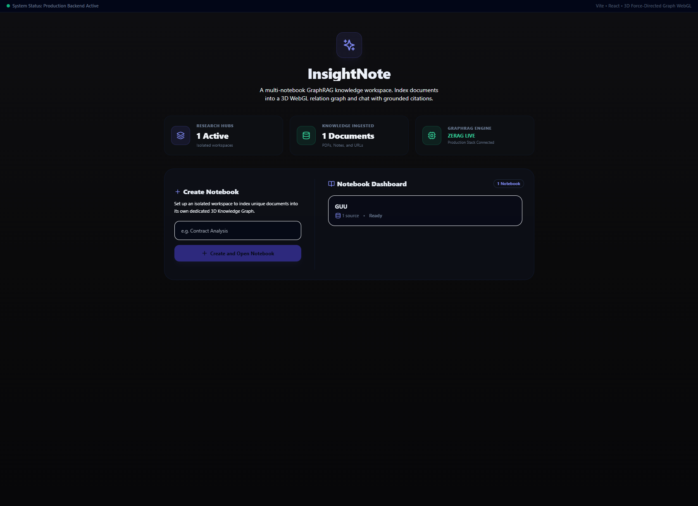

# InsightNote — Multi-Notebook GraphRAG Workspace

InsightNote is a **multi-notebook GraphRAG knowledge workspace** with a three-column UI: ingest sources on the left, grounded chat in the center, and a live 3D knowledge graph on the right.

It orchestrates **Neo4j** (graph), **Qdrant** (vectors), **MongoDB** (document status), and **PostgreSQL** (notebooks & chat history) under per-notebook isolation.


---

## Architecture

```txt
┌───────────────────────┬─────────────────────────────────┬────────────────────┐
│ Sources Panel (320px) │ Chat Q&A & Copilot (flex-1)     │ 3D Graph (480px)   │
├───────────────────────┼─────────────────────────────────┼────────────────────┤
│ URLs, notes, PDFs     │ Markdown answers, citations,    │ react-force-graph  │
│ Pipeline progress     │ retrieval steps, streaming chat   │ Path highlighting  │
└───────────────────────┴─────────────────────────────────┴────────────────────┘
         │                          │                              │
         └──────────────────────────┴──────────────────────────────┘
                                    │
                         frontend/src/lib/api.ts
                                    │
                         FastAPI /api/* (insightnote_routes.py)
                                    │
              ZeRAG + MultiRAG (MinerU) ──► Mongo + Neo4j + Qdrant + Postgres
```

---

## Key features

- **Multi-notebook isolation** — separate Qdrant collections, Neo4j workspace labels, and Postgres chat sessions per notebook
- **Layout-aware ingestion** — MinerU parses PDFs with bounding-box coordinates for grounded citations
- **Hybrid GraphRAG retrieval** — vector search + graph traversal + reranking (`mix` mode default)
- **Streaming chat** — metadata (citations, graph path) first, then token stream
- **3D graph highlights** — cyan for query reasoning paths, emerald for newly ingested nodes
- **Sandbox fallback** — frontend auto-falls back to mock data when backend/DB is down

---

## Screenshots

| Dashboard | Workspace |
|---|---|
|  |  |

---

## Quick start

See **[docs/SETUP.md](docs/SETUP.md)** for full configuration.

```bash
cp .env.example .env          # fill in API keys
docker compose up -d --build  # start full stack
```

Open **http://localhost:3000**

---

## Documentation map

### Getting started

| Document | Description |
|---|---|
| **[docs/SETUP.md](docs/SETUP.md)** | Environment, LLM profiles, quick start |
| **[docs/DOCKER.md](docs/DOCKER.md)** | Docker Compose workflows |
| **[docs/CONFIG_REFERENCE.md](docs/CONFIG_REFERENCE.md)** | All config.yaml & .env keys |
| **[docs/TROUBLESHOOTING.md](docs/TROUBLESHOOTING.md)** | Common issues & fixes |
| **[CONTRIBUTING.md](CONTRIBUTING.md)** | Branch workflow & pre-push checklist |

### Architecture & data

| Document | Description |
|---|---|
| **[docs/DATABASE_SCHEMA.md](docs/DATABASE_SCHEMA.md)** | Postgres, Mongo, Neo4j, Qdrant schemas |
| **[docs/DEMO_DATA.md](docs/DEMO_DATA.md)** | Sandbox mode, mock data, example PDF |
| **[backend/docs/RAG_ARCHITECTURE.md](backend/docs/RAG_ARCHITECTURE.md)** | Multi-workspace RAG engine |
| **[backend/docs/QUERY.md](backend/docs/QUERY.md)** | Query modes & chat history |
| **[backend/docs/MULTIMODAL_PARSING.md](backend/docs/MULTIMODAL_PARSING.md)** | MinerU parsing pipeline |
| **[backend/docs/CHUNKING.md](backend/docs/CHUNKING.md)** | Bbox chunking & Neo4j tree |

### Frontend & API

| Document | Description |
|---|---|
| **[frontend/docs/API_CONTRACT.md](frontend/docs/API_CONTRACT.md)** | Full REST API reference |
| **[frontend/docs/DEVELOPMENT_GUIDE.md](frontend/docs/DEVELOPMENT_GUIDE.md)** | Frontend architecture & components |
| **[frontend/README.md](frontend/README.md)** | Frontend quick start |
| **[backend/README.md](backend/README.md)** | Backend structure & testing |

### UI behavior

| Document | Description |
|---|---|
| **[docs/GROUNDED_CITATIONS.md](docs/GROUNDED_CITATIONS.md)** | Citation grounding & streaming |
| **[docs/GRAPH_VISUALIZATION.md](docs/GRAPH_VISUALIZATION.md)** | WebGL graph rendering |
| **[AGENTS.md](AGENTS.md)** | AI agent coding rules |

---

## Tech stack

- **Frontend:** Vite + React + TypeScript + Tailwind + `react-force-graph-3d` (Three.js)
- **Backend:** FastAPI + Pydantic + ZeRAG core + MultiRAG (MinerU)
- **Databases:** MongoDB, Neo4j (DozerDB), Qdrant, PostgreSQL

---

## Development branches

| Branch | Purpose |
|---|---|
| `develop` | Active development |
| `release` | Staging / pre-release |
| `main` | Production releases |
