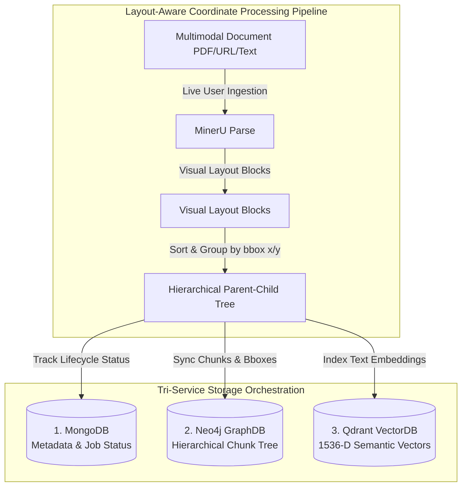

# 🧠 InsightNote Backend — Multi-Notebook GraphRAG Engine

Welcome to the **InsightNote** backend. This is a high-performance, enterprise-grade **Multi-Notebook GraphRAG (Zero-effort Retrieval-Augmented Generation)** service. It acts as the intelligent co-pilot, transforming raw unstructured documents into structured, interconnected semantic knowledge networks.

Rather than running as a flat vector search, this backend orchestrates **Neo4j**, **Qdrant**, **MongoDB**, and **PostgreSQL** to achieve physical multi-workspace database isolation, parent-child context hierarchy traversals, and dynamic reasoning path highlights.

---

## 🚀 Key Architectural Highlights

### 🌲 Layout-Aware Coordinate Processing Pipeline
Unlike traditional character-splitting chunkers, our ingestion pipeline processes document sections as highly structured **Hierarchical Knowledge Trees** utilizing visual bounding boxes (`bbox`) extracted via MinerU.



### 💎 Advanced Backend Features
1.  **True Multi-Workspace Isolation 🆕**: Scalable namespace and label prefixing in Neo4j, MongoDB, and Qdrant under individual `notebook_id` keys.
2.  **Conversational Thread Persistence 🆕**: Fully async database management of conversation threads and cascade deletions using **PostgreSQL** + `asyncpg`.
3.  **Layout-Aware Visual Chunking**: Coordinate-based `bbox` tracking `[x_min, y_min, x_max, y_max]` allows the front-end to highlight exact visual citations.
4.  **Premium Dual Retrieval + Reranking**: Integrates dense vector search in Qdrant with Cypher graph traversal in Neo4j. Employs advanced cross-encoders (**BAAI BGE-Reranker-M3**, **Jina AI**, or **Cohere**) to filter out noise.
5.  **Graceful Degraded Mode**: If database clusters (Neo4j, Mongo, PostgreSQL) are down, the server automatically degrades into an in-memory/JSON sandbox mode without breaking compilation or raising red screens.

---

## 📂 Backend Documentation Map

To explore the deep implementation details, please refer to:
*   📘 **[`backend/docs/RAG_ARCHITECTURE.md`](docs/RAG_ARCHITECTURE.md)**: Dynamic Multi-workspace isolation, coordinate tracking, EventStream protocol, and the dual-engine retrieval flow.
*   📘 **[`backend/docs/MULTIMODAL_PARSING.md`](docs/MULTIMODAL_PARSING.md)**: OCR parsing, LaTeX formulas, and table reconstruction using MinerU.
*   📘 **[`backend/docs/CHUNKING.md`](docs/CHUNKING.md)**: Bounding box coordinate sorting and hierarchical parent-child mapping in Neo4j.
*   📘 **[`backend/docs/QUERY.md`](docs/QUERY.md)**: Dynamic multi-turn history resolution and the four retrieval query modes (`mix`, `hybrid`, `local`, `global`).

---

## ⚡ Quick Start

### 1. Requirements & Environments
The RAG pipeline requires standard GPU resource configurations for layout extraction (MinerU) and embedding rerankers.
*   **Production/Docker Stack**:
    ```bash
    docker compose up -d --build
    ```
*   **Backend Developer Environment (`gpu_env`)**:
    Always activate the conda `gpu_env` when running unit or pipeline integration tests locally:
    ```bash
    conda activate gpu_env
    cd backend
    python server.py
    ```

### 2. Run Verification and Tests
*   **Run Unit Tests**:
    ```bash
    pytest tests/unit/ -v
    ```
*   **Verify E2E Backend Pipeline**:
    ```bash
    python ../scripts/verify_backend_pipeline.py
    ```

---

## ⚙️ Maintenance: Docker Volume Reset

Use these instructions to wipe database volumes and start with a fresh slate.

### Volume Configuration
| Service | Docker Volume Name | Data Stored |
| :--- | :--- | :--- |
| MongoDB | `insightnote_mongo_data` | Document lifecycle state, ingestion progress, and LLM caches |
| Neo4j   | `insightnote_neo4j_data` | Knowledge Graph (Entities, Relations, chunk trees) |
| Qdrant  | `insightnote_qdrant_data` | Semantic vector indices (text embeddings) |
| Postgres| `insightnote_postgres_data`| Conversational history and multi-notebook workspaces |

### Reset Procedures
```bash
# Bring the stack down and wipe all associated volumes
docker compose down -v
```
