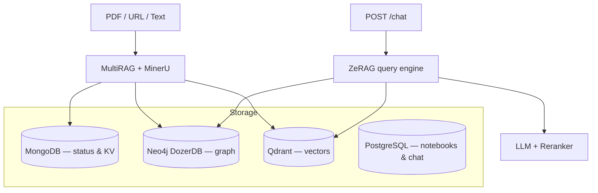

# InsightNote Backend

FastAPI backend for multi-notebook GraphRAG: document ingestion (MinerU/MultiRAG), hybrid retrieval (ZeRAG), and REST API for the three-column frontend.

---

## Architecture



---

## Directory structure

```txt
backend/
├── server.py                          # FastAPI entry, ZeRAG + MultiRAG init
├── config.py                          # Loads config/config.yaml + .env
├── config/config.yaml                 # LLM, embedding, reranker, storage backends
├── app/
│   ├── api/routers/
│   │   ├── insightnote_routes.py      # Primary /api/* notebook endpoints
│   │   ├── document_routes.py         # Document upload & pipeline
│   │   ├── query_routes.py            # Low-level query API
│   │   ├── graph_routes.py            # Graph utilities
│   │   └── history_routes.py          # Chat history routes
│   ├── core/
│   │   ├── zerag.py                   # ZeRAG engine
│   │   ├── document/multirag.py       # MultiRAG + MinerU wrapper
│   │   ├── history/chat_history.py    # PostgreSQL asyncpg layer
│   │   └── kg/                        # Neo4j, Qdrant, Mongo implementations
│   └── tests/
│       ├── unit/
│       └── regression/
└── docs/                              # Backend architecture docs
```

---

## Configuration

**Single source of truth:** `backend/config/config.yaml` + `.env` at project root.

See **[../docs/SETUP.md](../docs/SETUP.md)** for LLM profiles, database URLs, and Docker notes.

Key points:
- LLM binding/model/base_url come from YAML — not from bare `docker-compose` env vars
- `POSTGRES_URI` is read directly by `chat_history.py`
- Storage backends selected in YAML `storage:` section

---

## Running locally

```bash
conda activate gpu_env
cd backend
python server.py
```

Server listens on **http://0.0.0.0:8000**. Startup banner prints active LLM, embedding, and storage config.

---

## Running with Docker

```bash
docker compose up -d --build
```

Backend container mounts `./backend:/app` for hot reload. Persistent data in Docker volumes (`mongo_data`, `neo4j_data`, `qdrant_data`, `postgres_data`).

---

## Testing

```bash
conda activate gpu_env
cd backend

pytest tests/ -v                  # full suite
pytest tests/unit/ -v             # unit only
pytest tests/regression/ -v       # regression
```

Or via Taskfile from project root: `task test:all`

---

## API overview

Primary router: `insightnote_routes.py` with prefix `/api`.

| Category | Endpoints |
|---|---|
| Health | `GET /api/health` |
| Notebooks | `GET/POST /api/notebooks`, `GET/DELETE /api/notebooks/{id}` |
| Sources | `GET /api/notebooks/{id}/sources`, upload, URL/note streams, delete |
| Pipeline | `GET /api/pipeline/jobs/{job_id}` |
| Graph | `GET /api/notebooks/{id}/graph`, node details, neighbors |
| Chat | `GET /api/notebooks/{id}/chat/history`, `POST /api/notebooks/{id}/chat` |

Legacy flat endpoints (still supported): `/api/sources`, `/api/chat`, `/api/graph`.

Full contract: **[../frontend/docs/API_CONTRACT.md](../frontend/docs/API_CONTRACT.md)**

---

## Deep-dive docs

| Document | Topic |
|---|---|
| [docs/RAG_ARCHITECTURE.md](docs/RAG_ARCHITECTURE.md) | Multi-workspace isolation, dual retrieval |
| [docs/MULTIMODAL_PARSING.md](docs/MULTIMODAL_PARSING.md) | MinerU layout parsing |
| [docs/CHUNKING.md](docs/CHUNKING.md) | Bbox hierarchical chunk tree |
| [docs/QUERY.md](docs/QUERY.md) | Query modes & chat history |
| [../docs/DATABASE_SCHEMA.md](../docs/DATABASE_SCHEMA.md) | Database schemas & isolation |
| [../docs/CONFIG_REFERENCE.md](../docs/CONFIG_REFERENCE.md) | All config keys |
| [../frontend/docs/API_CONTRACT.md](../frontend/docs/API_CONTRACT.md) | REST API |

---

## Maintenance

### Reset database volumes

```bash
docker compose down -v
```

### Logs

Server log: `backend/logs/server.log`

### GPU environment

Always use `gpu_env` for pytest and pipeline indexing tests. MinerU and embedding workloads are GPU-intensive; CPU fallback is configured in `server.py` but slower.
