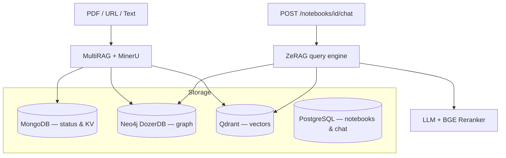

# InsightNote Backend

FastAPI backend for multi-notebook GraphRAG: document ingestion (MinerU / MultiRAG), hybrid retrieval (ZeRAG), and REST API for the three-column frontend.

**Setup (required first):** [../docs/SETUP.md](../docs/SETUP.md)  
**API contract:** [../frontend/docs/API_CONTRACT.md](../frontend/docs/API_CONTRACT.md)

---

## Start here

| Task | Document / command |
|---|---|
| Run locally | `conda activate gpu_env && python server.py` |
| Configure LLM / embedding | [../docs/SETUP.md](../docs/SETUP.md) · `config/config.yaml` |
| Understand RAG pipeline | [docs/RAG_ARCHITECTURE.md](docs/RAG_ARCHITECTURE.md) |
| Query modes (`naive` … `mix`) | [docs/QUERY.md](docs/QUERY.md) |
| Run benchmarks | [docs/BENCHMARKING.md](docs/BENCHMARKING.md) |
| Database layout | [../docs/DATABASE_SCHEMA.md](../docs/DATABASE_SCHEMA.md) |
| Run tests | `pytest tests/ -v` in `gpu_env` |

---

## Architecture



**Entry point:** `server.py` — initializes ZeRAG, MultiRAG, and mounts routers under `/api`.

**Primary router:** `app/api/routers/insightnote_routes.py` (notebook-scoped endpoints).  
Legacy flat routes in the same file: `/api/sources`, `/api/chat`, `/api/graph`.

---

## Ingestion pipeline

| Source type | Pipeline steps |
|---|---|
| PDF / file upload | `load_file` → `document_understanding` (MinerU) → `vector_graph_sync` |
| URL / note | `load_file` → `chunking` → `entity_extraction` → `vector_graph_sync` |

Progress polling: `GET /api/pipeline/jobs/{job_id}`

Deep dives: [docs/MULTIMODAL_PARSING.md](docs/MULTIMODAL_PARSING.md) · [docs/CHUNKING.md](docs/CHUNKING.md)

---

## Query modes

Implementation: `_perform_kg_search()` in `app/core/operate.py`.

| API `mode` | Engines used | Notes |
|---|---|---|
| `naive` | Qdrant vectors only | Fastest; no graph traversal |
| `local` | Entity / Neo4j **nodes** | Low-level keyword → `_get_node_data()` |
| `global` | Relationship / Neo4j **edges** | High-level keyword → `_get_edge_data()` |
| `hybrid` | Entity + relationship | No extra vector pass |
| `mix` | Entity + relationship + vector | **Default**; slowest, richest context |

Expected latency: `naive < local ≈ global < hybrid < mix`

> In the ZeRAG API, **`local` = entity** and **`global` = relationship**. Always pass the API mode string to the backend.

Full reference: [docs/QUERY.md](docs/QUERY.md)

---

## Directory structure

```txt
backend/
├── server.py                          # FastAPI entry, ZeRAG + MultiRAG init
├── config.py                          # Loads config/config.yaml + .env
├── config/config.yaml                 # LLM, embedding, reranker, storage backends
├── app/
│   ├── api/routers/
│   │   ├── insightnote_routes.py      # Primary /api/* notebook endpoints
│   │   ├── document_routes.py         # Document upload & pipeline helpers
│   │   ├── query_routes.py            # Low-level query API
│   │   ├── graph_routes.py            # Graph utilities
│   │   └── history_routes.py          # Chat history routes
│   ├── core/
│   │   ├── operate.py                 # Query mode engine (_perform_kg_search)
│   │   ├── zerag.py                   # ZeRAG engine wrapper
│   │   ├── document/multirag.py       # MultiRAG + MinerU wrapper
│   │   ├── history/chat_history.py    # PostgreSQL asyncpg layer
│   │   └── kg/                        # Neo4j, Qdrant, Mongo implementations
│   └── tests/
│       ├── unit/
│       ├── regression/
│       └── locustfile_modes.py        # Per-mode Locust load test
├── docs/                              # Backend architecture docs
└── tests/fixtures/                    # Sample inputs for tests & benchmarks
```

---

## Configuration

**Single source of truth:** `config/config.yaml` + `.env` at project root.

| Setting | Where |
|---|---|
| LLM binding, model, base URL | `config/config.yaml` → `llm:` |
| Embedding & reranker | `config/config.yaml` → `embedding:` / `reranker:` |
| Storage backends | `config/config.yaml` → `storage:` |
| API keys | `.env` — referenced in YAML as `${VAR_NAME}` |
| Postgres chat history | `POSTGRES_URI` in `.env` |

See [../docs/CONFIG_REFERENCE.md](../docs/CONFIG_REFERENCE.md) for every key.

> `LLM_BINDING` in `docker-compose.yml` is **not** read unless referenced inside YAML.

---

## Running locally

```bash
# 1. Start databases
docker compose up -d postgres mongodb neo4j qdrant

# 2. Backend (gpu_env required for MinerU tests & GPU pipeline)
conda activate gpu_env
cd backend
python server.py
```

Server: **http://0.0.0.0:8000** · Swagger: **http://localhost:8000/docs**  
Startup banner prints active LLM, embedding, and storage config.

---

## Running with Docker

```bash
docker compose up -d --build
```

Backend container mounts `./backend:/app` for hot reload. Persistent data in Docker volumes (`mongo_data`, `neo4j_data`, `qdrant_data`, `postgres_data`).

---

## Testing

Always use **`gpu_env`** — MinerU and embedding workloads are GPU-intensive.

```bash
conda activate gpu_env
cd backend

pip install -r requirements.txt      # full runtime (MinerU + Crawl4AI + torch stack)
pytest tests/ -v                  # full suite
pytest tests/unit/ -v             # unit only
pytest tests/regression/ -v       # regression
```

**CI note:** GitHub Actions uses `requirements-ci.txt` for fast `compileall`, then validates that `requirements.txt` resolves (Python 3.12). Local dev and Docker always use `requirements.txt`.

From project root: `task test:all`

---

## Benchmarking

Live benchmark pipeline (MinerU ingest + query latency + quality charts):

```bash
conda activate gpu_env
docker compose up -d postgres mongodb neo4j qdrant
cd backend && python server.py   # separate terminal

# From project root
python scripts/benchmark/run_full_benchmark_suite.py
```

Individual steps:

```bash
python scripts/benchmark/run_mode_latency_benchmark.py --notebook auto --rounds 3
python scripts/benchmark/run_quality_chunk_sweep.py --notebook auto --k-step 5
python scripts/benchmark/run_ingest_concurrency_benchmark.py --notebook auto
python scripts/benchmark/generate_benchmark_charts.py
```

Results: `docs/benchmark_results/` · Charts: `docs/images/benchmark/`

Locust CCU test: `locust -f tests/locustfile_modes.py --host=http://localhost:8000`

Full spec: [docs/BENCHMARKING.md](docs/BENCHMARKING.md)

---

## API overview

Prefix: `/api` · Router: `insightnote_routes.py`

| Category | Endpoints |
|---|---|
| Health | `GET /api/health` |
| Notebooks | `GET/POST /api/notebooks`, `GET/DELETE /api/notebooks/{id}` |
| Sources | `GET/POST/DELETE /api/notebooks/{id}/sources/…` (upload, URL, note, streams) |
| Pipeline | `GET /api/pipeline/jobs/{job_id}` |
| Graph | `GET /api/notebooks/{id}/graph`, node details, neighbors |
| Chat | `GET /api/notebooks/{id}/chat/history`, `POST /api/notebooks/{id}/chat` |

Request body for chat: `{ "message": "…", "mode": "mix", "stream": true, "chunk_top_k": 10 }`

Full contract: [../frontend/docs/API_CONTRACT.md](../frontend/docs/API_CONTRACT.md)

---

## Deep-dive docs

| Document | Topic |
|---|---|
| [docs/RAG_ARCHITECTURE.md](docs/RAG_ARCHITECTURE.md) | Multi-workspace isolation, dual retrieval |
| [docs/MULTIMODAL_PARSING.md](docs/MULTIMODAL_PARSING.md) | MinerU layout parsing |
| [docs/CHUNKING.md](docs/CHUNKING.md) | Bbox hierarchical chunk tree |
| [docs/QUERY.md](docs/QUERY.md) | Query modes & chat history |
| [docs/BENCHMARKING.md](docs/BENCHMARKING.md) | Performance & quality benchmarks |
| [../docs/DATABASE_SCHEMA.md](../docs/DATABASE_SCHEMA.md) | Database schemas & isolation |
| [../docs/CONFIG_REFERENCE.md](../docs/CONFIG_REFERENCE.md) | All config keys |

---

## Maintenance

```bash
docker compose down -v    # reset all database volumes
```

Server log: `logs/server.log`
