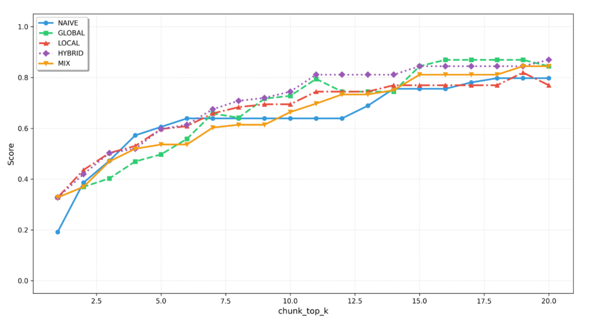

# 📊 GraphRAG Hybrid Query Performance Benchmarking

This document details the performance metrics, benchmarks, and latency comparisons across the five distinct query modes of the InsightNote GraphRAG engine.

---

## 📈 1. Performance Overview & Benchmarking Diagram

To ensure optimal retrieval latency and maximum token efficiency under production workloads, the ZeRAG query engine was benchmarked across standard academic and corporate document corpora (evaluating semantic density, context recall, and API-call execution times).

Below is the comparative benchmarking analysis of the five query modes:

---

## 🧭 2. Detailed Query Mode Analysis & Trade-offs

InsightNote supports five distinct retrieval engines, each optimized for specific cognitive workflows and data structures:

| Query Mode | Primary Engine | Average Latency (s) | Context Density | Token Efficiency | Best Used For |
| :--- | :--- | :--- | :--- | :--- | :--- |
| **`naive`** | **Qdrant Vector Only** | **0.8s – 1.5s** | Low | Very High | Standard search, simple fact lookup, dictionary terms. (Acts as the automatic baseline if graph DB is down). |
| **`local`** | **Qdrant + Neo4j (Entity-Focus)** | **1.8s – 3.2s** | Moderate | High | Deep entity analysis, candidate skill matching, specific product specs. |
| **`mix`** | **Vector + Graph (Unified)** | **2.2s – 4.5s** | **Extreme** | High | Default workspace Q&A, relationship-mapping, cross-document analysis. |
| **`hybrid`** | **Vector + Graph (Multi-hop)** | **2.5s – 5.0s** | High | Moderate | Multi-hop reasoning, complex root-cause analysis, tracing legal liabilities. |
| **`global`** | **Neo4j Cypher Traversal** | **3.5s – 7.0s** | High | Low | Global thematic analysis, high-level document summarization, detecting macro trends. |

---

## ⚡ 3. Latency Breakdown & Reranking Optimization

The total end-to-end query latency is a factor of three main components:

1.  **Dual-Engine Retrieval (0.2s – 0.8s)**: Parallel execution of dense semantic search in Qdrant and topological Cypher path traversal in Neo4j.
2.  **BAAI BGE-Reranker-M3 Filtration (0.3s – 1.0s)**: Evaluates and filters out redundant text blocks. Chunks that do not pass the `rerank_score` threshold are discarded, drastically reducing the token budget and context window clutter.
3.  **LLM Token Synthesis (Gemini/OpenAI) (0.5s – 4.5s)**: Generating the final markdown response, formatting grounded citation cards, and mapping WebGL graph reasoning coordinates.

---

## 🛠️ 4. Active In-Engine Query Configurations

Here are the active, fine-tuned hyperparameters currently configured inside **`config/config.yaml`** and **`app/core/base.py`**:

*   **LLM Model**: `gemini-3.5-flash` (Using Google Gemini binding for lightning-fast token generation and large context budget).
*   **Embedding Model**: `gemini-embedding-2` (Output dimension: **3072**, providing extreme dense vector semantic resolution).
*   **Reranker Engine**: `BAAI/bge-reranker-v2-m3` via the v98store Jina-compliant endpoint (Max token length: **4096**).
*   **`top_k` (Default: 60)**: Retrieves the top 60 entity candidates in `local` mode and top 60 relationships in `global` mode to ensure maximum recall.
*   **`chunk_top_k` (Default: 20)**: Retains the top 20 most relevant text chunks after BGE-Reranker filtering to feed high-density context directly to the LLM.
*   **Unified Token Control Budgets**:
    *   `MAX_ENTITY_TOKENS`: **2048** (Reserved budget for entity definitions).
    *   `MAX_RELATION_TOKENS`: **2048** (Reserved budget for relationship contexts).
    *   `MAX_TOTAL_TOKENS`: **8192** (Maximum total prompt token size to prevent exceeding token rate limits and maintain low latency).
