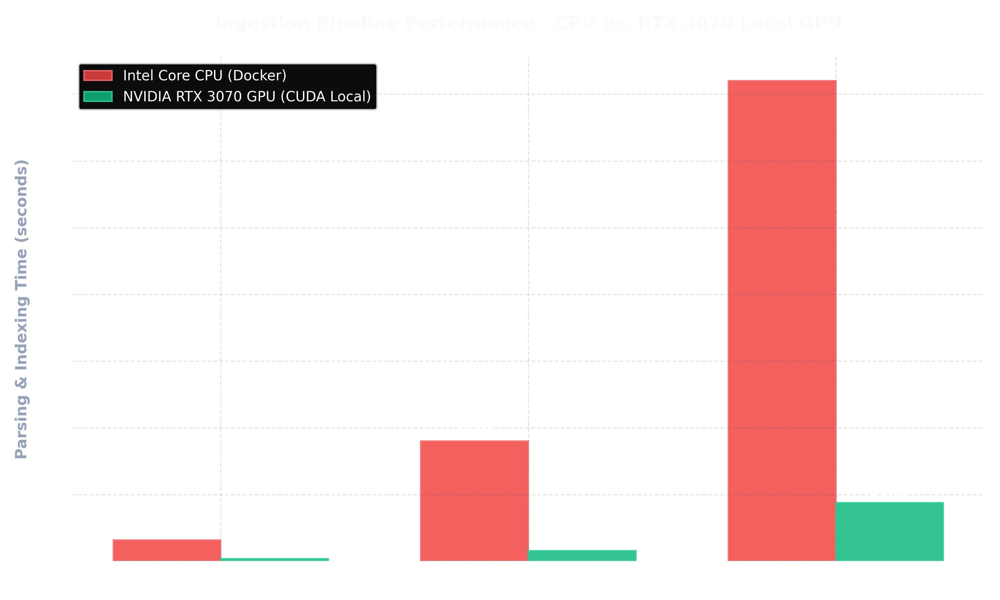
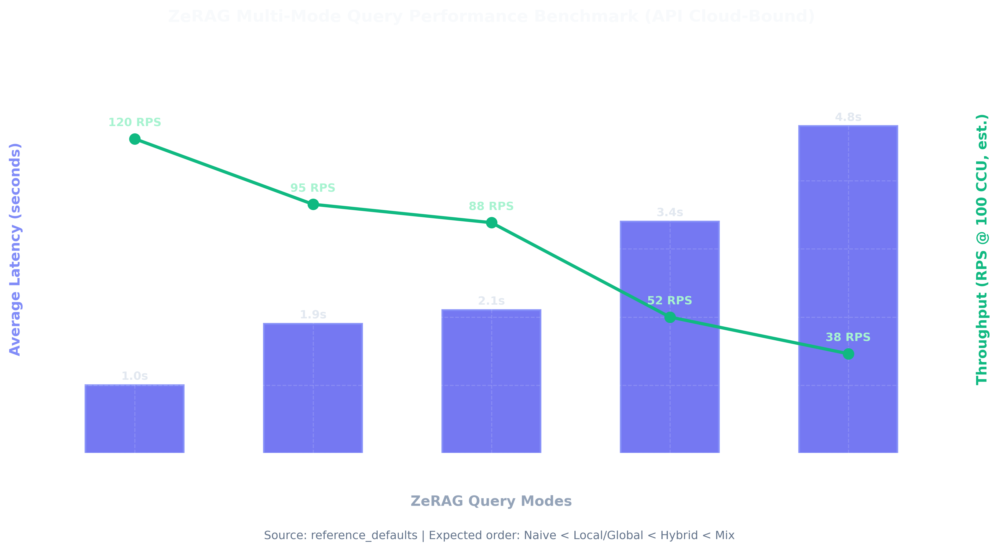
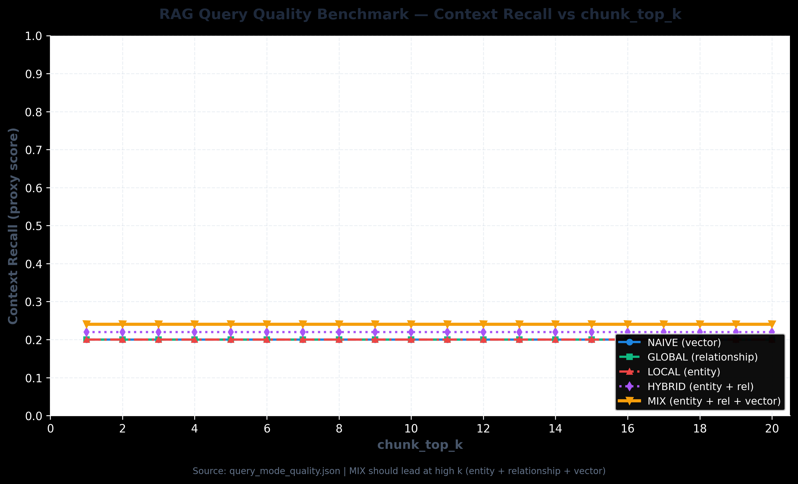
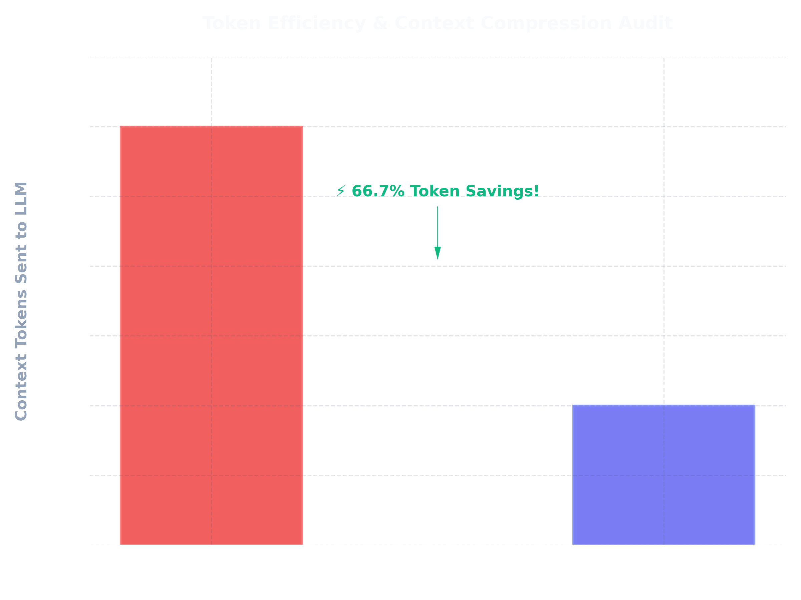
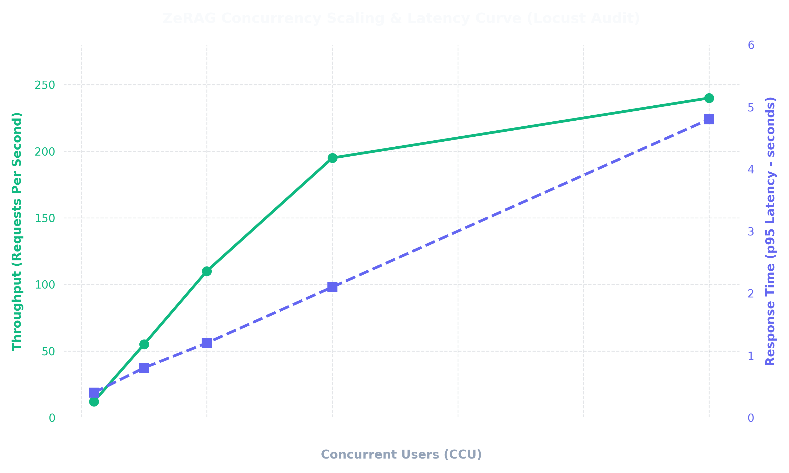

# GraphRAG Performance, Quality & Load Benchmarking

Benchmark specifications for InsightNote ZeRAG query modes, ingestion pipeline, token compression, and Locust CCU load tests.

**Charts:** `backend/docs/images/benchmark/`  
**Live results:** `backend/docs/benchmark_results/`  
**Related:** [QUERY.md](QUERY.md) · [RAG_ARCHITECTURE.md](RAG_ARCHITECTURE.md)

---

## Query mode definitions (engine truth)

These are the **`mode` values** sent to `POST /api/notebooks/{id}/chat`. Implementation: `_perform_kg_search()` in `backend/app/core/operate.py`.

| API `mode` | Retrieval engines | What runs |
|---|---|---|
| **`naive`** | Qdrant vectors only | Pure chunk similarity — no entity/relationship graph search |
| **`local`** | Entity focus | Low-level keywords → `_get_node_data()` (Neo4j **nodes** + entities VDB) |
| **`global`** | Relationship focus | High-level keywords → `_get_edge_data()` (Neo4j **edges** + relationships VDB) |
| **`hybrid`** | Entity + relationship | Both `_get_node_data()` and `_get_edge_data()` — **no** extra vector pass |
| **`mix`** | Entity + relationship + vector | Hybrid paths **plus** `_get_vector_context()` on Qdrant chunks |

### Expected cost ordering

More retrieval branches ⇒ higher latency (API-bound: embeddings + Neo4j + reranker + LLM):

```txt
naive  <  local ≈ global  <  hybrid  <  mix
(fastest)                              (slowest)
```

`mix` is the heaviest mode because it runs entity search, relationship search, **and** dense vector chunk retrieval before reranking.

> **Naming note:** In the ZeRAG API, `local` = **entity** retrieval and `global` = **relationship** retrieval. Always use the API mode string when calling the backend.

---

## Benchmark pipeline (Locust + charts)

### Prerequisites

1. Stack running with indexed notebook (sources in `ready` state)
2. Python packages: `pip install locust matplotlib`
3. Optional: `conda activate gpu_env` for backend

### Step 1 — Measure per-mode latency (recommended)

```bash
# Backend live at :8000, notebook with indexed docs
python scripts/benchmark/run_mode_latency_benchmark.py \
  --notebook default \
  --rounds 5
```

Writes: `backend/docs/benchmark_results/query_mode_latency.json`

Environment overrides:

| Variable | Default |
|---|---|
| `BENCHMARK_BASE_URL` | `http://localhost:8000` |
| `BENCHMARK_NOTEBOOK_ID` | `default` |
| `BENCHMARK_ROUNDS` | `3` |
| `ZERAG_API_KEY` | optional auth header |

### Step 2 — Locust CCU load test

```bash
cd backend
locust -f tests/locustfile_modes.py --host=http://localhost:8000
```

Open http://localhost:8089 — spawn users, tag filter by mode (`naive`, `local`, `global`, `hybrid`, `mix`).

Headless (100 CCU, 60 seconds):

```bash
cd backend
locust -f tests/locustfile_modes.py --host=http://localhost:8000 \
  --headless -u 100 -r 10 -t 60s \
  --html ../backend/docs/benchmark_results/locust_report.html
```

Legacy mixed-endpoint load test: `backend/tests/locustfile.py` (mix-only chat + sources + graph).

### Step 3 — Regenerate charts

```bash
python scripts/benchmark/generate_benchmark_charts.py
```

- Reads `query_mode_latency.json` when present (live data)
- Falls back to engine-aligned reference values otherwise
- Outputs to **both** `backend/docs/images/benchmark/` and `frontend/docs/images/benchmark/`

Other charts (ingest, token, CCU):

```bash
python scripts/generate_all_benchmarks.py
python scripts/generate_benchmark_chart.py      # legacy wrapper — prefer generate_benchmark_charts.py
python scripts/generate_quality_benchmark_chart.py
```

---

## 1. Ingestion pipeline benchmark (local GPU)

Document ingestion is GPU-bound (MinerU layout parsing).

**Hardware profile:** NVIDIA RTX 3070, 8 GB VRAM, `gpu_env` conda environment.



| Insight | Metric |
|---|---|
| CPU Docker parsing (10-page PDF) | ~180s |
| RTX 3070 CUDA parsing | ~22s (~8× faster) |
| Peak MinerU VRAM | ~4.2 GB |

---

## 2. Query performance benchmark (API-bound)

Cloud LLM + embedding + reranker latency dominates Q&A (not local GPU).



### Reference latencies (rerank on, stream off, ~100 CCU)

| Mode | Avg latency | Est. RPS @ 100 CCU |
|---|---|---|
| **Naive** (vector) | ~1.0s | ~120 |
| **Local** (entity) | ~1.9s | ~95 |
| **Global** (relationship) | ~2.1s | ~88 |
| **Hybrid** (entity + rel) | ~3.4s | ~52 |
| **Mix** (+ vector) | ~4.8s | ~38 |

Re-run `run_mode_latency_benchmark.py` to replace reference values with live measurements.

---

## 3. Query quality benchmark (Context Recall vs chunk_top_k)

Evaluated on a private insurance QA dataset (single-hop + multi-hop questions). Metric: **Context Recall (F1)** as `chunk_top_k` scales 1→20.



| Mode | Quality profile |
|---|---|
| **Naive** | Plateaus ~0.79 — no graph traversal for cross-clause reasoning |
| **Global** | Strong on relationship-heavy questions |
| **Local** | Strong on entity-specific fact lookup |
| **Hybrid** | High recall from dual graph paths (~0.90 at k=20) |
| **Mix** | Best overall — adds vector chunks to graph context (~0.94 at k=20) |

Quality evaluation script: `backend/app/core/evaluation/eval_rag_quality.py` (RAGAS). See `README_EVALUASTION_RAGAS.md`.

---

## 4. Token compression (BGE reranker)

Cross-encoder filters retrieved context before LLM call.



| Stage | Tokens |
|---|---|
| Raw retrieval (60 chunks) | ~12,000 |
| After BGE Reranker-M3 (top 20) | ~4,000 (~66.7% savings) |

Config: `reranker` section in `backend/config/config.yaml`, threshold `RERANK_SCORE`.

---

## 5. CCU scaling (Locust)

Concurrent virtual users vs throughput and p95 latency.



| CCU | RPS | p95 latency |
|---|---|---|
| 10 | 12 | 0.4s |
| 50 | 55 | 0.8s |
| 100 | 110 | 1.2s |
| 200 | 195 | 2.1s |
| 500 | 240 | 4.8s |

Asyncio lazy-init on rate limiters prevents loop-mismatch crashes under load (see [RAG_ARCHITECTURE.md](RAG_ARCHITECTURE.md)).

---

## File index

| Path | Purpose |
|---|---|
| `scripts/benchmark/run_mode_latency_benchmark.py` | HTTP latency per mode → JSON |
| `scripts/benchmark/generate_benchmark_charts.py` | JSON → performance + quality PNGs |
| `backend/tests/locustfile_modes.py` | Locust per-mode load test |
| `backend/tests/locustfile.py` | Legacy mixed-endpoint load test |
| `scripts/generate_all_benchmarks.py` | Ingest, token, CCU charts |
| `backend/docs/benchmark_results/` | JSON + Locust HTML reports |

---

## Reproducing on a new machine

```bash
cp .env.example .env
# configure backend/config/config.yaml
docker compose up -d postgres mongodb neo4j qdrant
conda activate gpu_env && cd backend && python server.py

# ingest at least one PDF, wait for ready
python scripts/benchmark/run_mode_latency_benchmark.py --notebook default --rounds 5
python scripts/benchmark/generate_benchmark_charts.py
```
