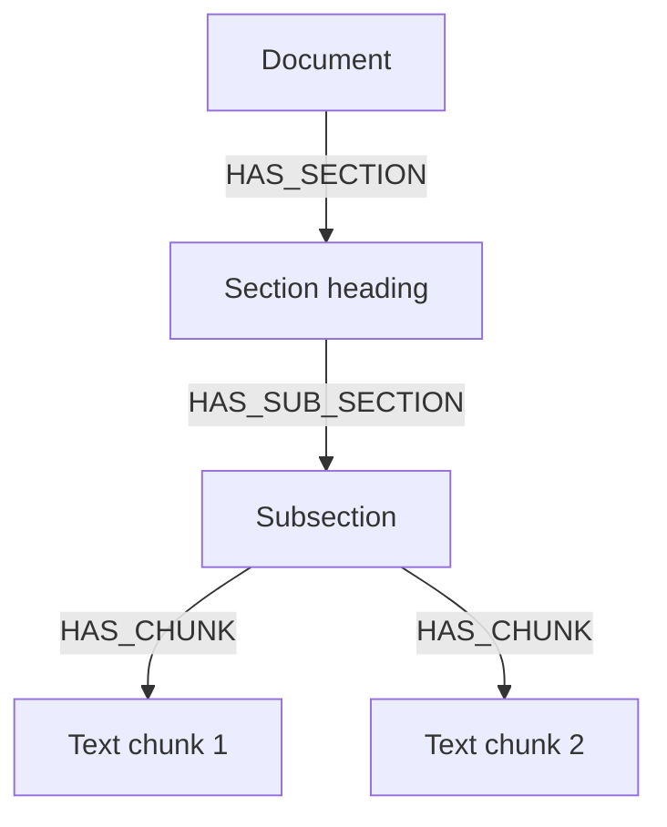

# Hierarchical Coordinate Chunking

How MinerU layout blocks become a parent-child chunk tree in Neo4j, synchronized with Qdrant vectors.

---

## Why coordinate chunking

Fixed-size character splitting breaks sentences, splits table columns, and loses section hierarchy. InsightNote uses **visual bounding boxes** from MinerU to preserve reading order and document structure.

| Method | Used in InsightNote |
|---|---|
| Fixed-size splitting | Fallback only |
| **Hierarchical bbox chunking** | **Primary method** |
| Semantic grouping | Complementary within sections |

---

## Bounding box structure

```json
{
  "type": "text",
  "bbox": [0.12, 0.34, 0.88, 0.41],
  "content": "Paragraph text..."
}
```

| Index | Meaning |
|---|---|
| `bbox[0]` | x_min (left) |
| `bbox[1]` | y_min (top) |
| `bbox[2]` | x_max (right) |
| `bbox[3]` | y_max (bottom) |

All values normalized 0.0–1.0.

---

## Reading order algorithm

For multi-column pages:

```txt
1. Detect column boundaries from overlapping x-coordinates
2. Partition blocks into left / right columns
3. Sort each column top-to-bottom by y_min
4. Merge: left column first, then right column
```

This prevents interleaved text from side-by-side layouts (resumes, financial reports, academic papers).

---

## Neo4j hierarchical tree



Each chunk node stores:
- `content` — raw text
- `bbox` — visual coordinates
- `page_number` — physical page index

Entity and relationship nodes are linked separately during extraction.

---

## Tri-service sync

| Service | Role |
|---|---|
| **MongoDB** | Document lifecycle, ingestion job status, metadata |
| **Neo4j** | Chunk hierarchy, entities, relationships |
| **Qdrant** | Dense embeddings; payload references Neo4j node ID |

During retrieval, Qdrant finds similar chunks; Neo4j climbs parent edges (`<-[:HAS_CHUNK]-`) to include section headers in LLM context.

---

## Embedding dimensions

Dimension depends on the configured embedding model in `config.yaml`:

| Model | Typical dimension |
|---|---|
| `text-embedding-3-small` | 1536 |
| `text-embedding-3-large` | 3072 |
| Gemini embeddings | Auto-detected at startup (fallback 3072) |

---

## Related docs

- [MULTIMODAL_PARSING.md](MULTIMODAL_PARSING.md) — MinerU output format
- [RAG_ARCHITECTURE.md](RAG_ARCHITECTURE.md) — ingestion orchestration
- [QUERY.md](QUERY.md) — how chunks are retrieved during chat
