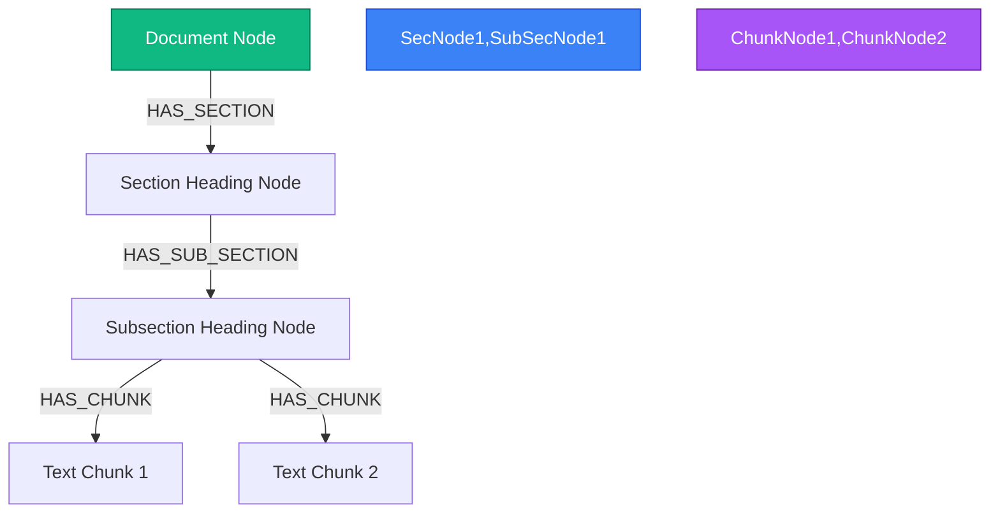

# 🌳 Hierarchical Coordinate Chunking Method

This specification document details the design and implementation of InsightNote's coordinate-aware **Hierarchical Chunking** algorithm. It explains how raw bounding box coordinates (`bbox`) are sorted, aligned, and mapped into a parent-child relational tree inside Neo4j, synchronized with Qdrant vectors and MongoDB metadata.

---

## 📐 1. Bounding Box Coordinates (`bbox`) Structure

Standard character-based sliding windows slice texts blindly, breaking paragraphs, splitting table columns, and throwing away visual clues (like bold headers, titles, and section levels). 

InsightNote extracts layout coordinates directly from the structured MinerU model output (such as `Resume_model.json`):

```json
{
  "type": "header",
  "bbox": [0.452, 0.064, 0.96, 0.093],
  "content": "NGUYEN PHUOC THANH"
}
```

*   `bbox[0]` ($x_{\min}$): Normal-normalized leftmost coordinate of the boundary box.
*   `bbox[1]` ($y_{\min}$): Normal-normalized topmost coordinate of the boundary box.
*   `bbox[2]` ($x_{\max}$): Normal-normalized rightmost coordinate of the boundary box.
*   `bbox[3]` ($y_{\max}$): Normal-normalized bottommost coordinate of the boundary box.
*   *Note: All coordinates range from `0.0` to `1.0`, keeping them completely fluid and resolution-independent.*

---

## 🧭 2. Reading Order Reconstruction Algorithm

For multi-column documents (such as academic publications, financial tables, or resume portfolios), parsing elements sequentially by file stream order results in chaotic, mixed sentences. The backend implements a **spatial-coordinate sorting algorithm** to accurately reconstruct the human reading order:

```txt
For each Page:
  1. Identify column margins by evaluating overlapping horizontal X-coordinates (x_min, x_max).
  2. If multiple vertical columns are detected:
     - Partition blocks into Left Column (x_max < center_threshold) and Right Column (x_min >= center_threshold).
  3. Sort blocks inside each column vertically by their y_min coordinate (top-to-bottom).
  4. Merge sorted columns sequentially (Left Column sorted blocks ➔ Right Column sorted blocks) to form a unified, natural reading stream.
```

---

## 🌳 3. Parent-Child Hierarchical Chunk Tree

After sorting, the engine structures the reading stream as a **Hierarchical Tree** inside Neo4j, establishing parent-child containment edges instead of flat, disconnected text chunk arrays:



### 1. Header Level & Subsection Tracking
*   `header`, `title`, and `section_heading` blocks are evaluated for their layout sizes and hierarchy positions.
*   A `title` block (or highest heading level) creates a root `Section` node in Neo4j.
*   Subsequent smaller headings create nested child `Subsection` nodes connected via `[:HAS_SUB_SECTION]` edges.

### 2. Coordinate-Based Containment
*   Standard narrative `text` blocks are grouped under their closest preceding heading node based on reading order sequence.
*   Each `Chunk` text node in Neo4j saves its raw string content alongside its visual coordinates (`bbox` property array) and page number, enabling the PDF viewer to highlight exact visual boundaries.

### 3. Decoupled Tri-Service Synchronization
*   **MongoDB**: Registers document upload metadata and tracks progress of the indexing job.
*   **Neo4j (DozerDB)**: Constructs the structural chunk hierarchy tree (`[:HAS_PARENT]`) and links extracted entity/relationship nodes.
*   **Qdrant**: Indexes the 1536-D embedding of each text chunk, saving its respective Neo4j Node ID in its vector payload.
*   *During Retrieval*: When Qdrant retrieves a specific text chunk, the RAG engine queries Neo4j to climb upwards (`<-[:HAS_CHUNK]-`) and pull the structural parent headers (e.g. section titles), supplying the LLM with complete, contextual visual grounding.
