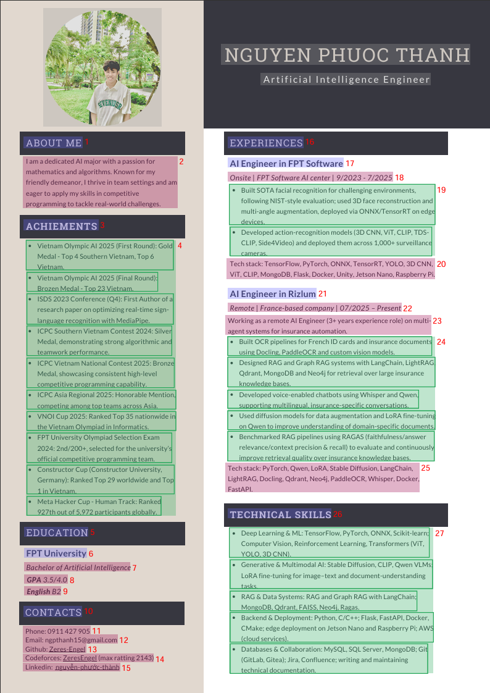

# 🧠 Multimodal Layout Parsing (MinerU Ingestion Engine)

This specification document details the design and implementation of InsightNote's multimodal document parsing engine using **MinerU**. It explains how the system handles multiple visual elements like tables, formulas, images, and text columns, transforming unstructured binaries into a highly structured JSON layout array.

---

## 📐 Ingestion Pipeline Flow

Standard RAG parsers treat documents as continuous flat strings, discarding all visual formatting, multi-column divisions, tables, and formula structures. InsightNote utilizes **MinerU**, a state-of-the-art layout-aware document parser, to preserve multi-column reading order and structural element identities.

The following architectural block diagram shows how documents of multiple formats (PDFs, Scans, Images) are parsed and modularized into structured JSON outputs:

```txt
                       ┌──────────────────────────┐
                       │   Multimodal Document    │
                       │ (PDF, Image, Scan, Text) │
                       └────────────┬─────────────┘
                                    │
                                    ▼
                       ┌──────────────────────────┐
                       │   MinerU Parsing Engine  │
                       │   (Layout OCR Analysis)  │
                       └────────────┬─────────────┘
      ┌─────────────────────────────┼─────────────────────────────┐
      ▼                             ▼                             ▼
┌───────────┐                 ┌───────────┐                 ┌───────────┐
│Text Blocks│                 │ Formulas  │                 │  Tables   │
│  & Bboxes │                 │  & LaTeX   │                 │  & Figures│
└─────┬─────┘                 └─────┬─────┘                 └─────┬─────┘
      └─────────────────────────────┼─────────────────────────────┘
                                    │
                                    ▼
                       ┌──────────────────────────┐
                       │ Structural JSON Output   │
                       │  (Sorted Reading Order)  │
                       └──────────────────────────┘
```

---

## 🛠️ Parser Element Specifications

The MinerU parsing engine divides document visual streams into highly specialized sub-elements:

### 1. Text Elements Extraction
Raw text blocks are isolated from structural background noise. Discarded blocks like page headers and footers are automatically filtered out from the final chunk text body to prevent indexing redundant headers across chunks, but they are stored in MongoDB as document page-level metadata.

### 2. LaTeX Formula Decoding
Mathematical equations and inline formulas are detected using visual bounding box layouts. Instead of losing mathematical operators or generating unreadable plain text, they are automatically translated to standardized LaTeX formatting strings:
*   *Example*: $f(x) = \sigma(W^T x + b)$ is stored as `"content": "$f(x) = \\sigma(W^T x + b)$"`.
*   This prevents the LLM tokenization from distorting math logic during RAG context synthesis.

### 3. Markdown Table Restructuring
Multimodal tables and spreadsheet grids are analyzed for horizontal and vertical rows. The parser reconstructs them as structured Markdown grids instead of flat text. This ensures row-column alignment and tabular context are preserved when vector embeddings are calculated and saved to the Qdrant index.

### 4. Figure & Caption Association
Captions are dynamically bound to their respective figures using coordinate proximities, preventing image descriptions from floating detached into unrelated text segments.

---

## 📸 Layout Ingestion Panel Visualization

The image below illustrates the live multimodal parsing processing panel, illustrating how complex layouts, titles, formulas, and structural elements are visually mapped and parsed in real-time:


