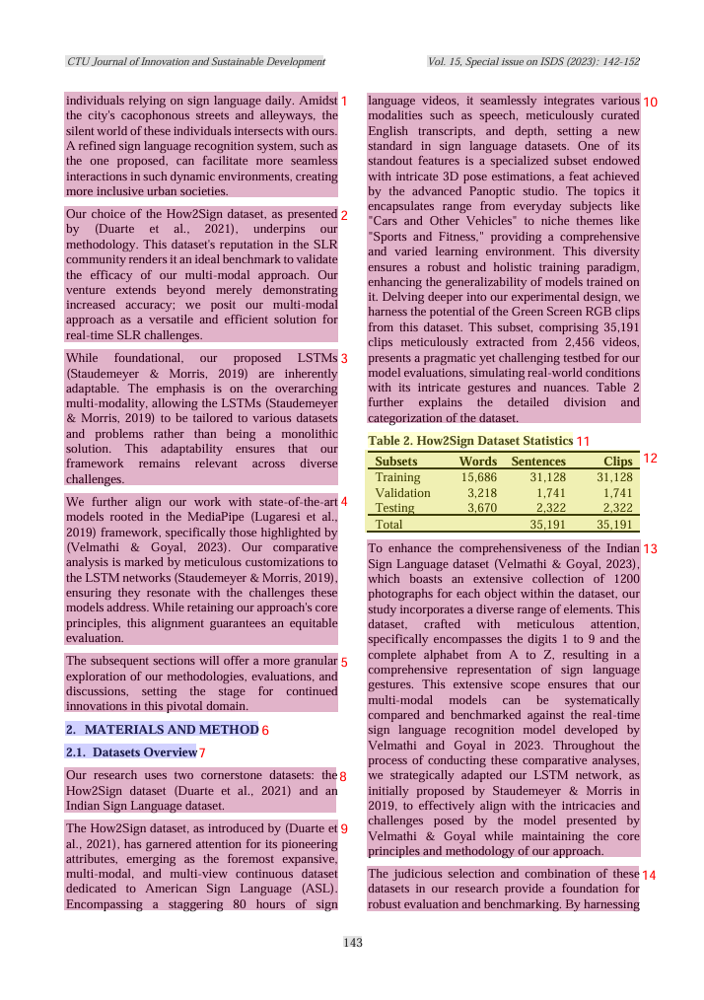

# Multimodal Layout Parsing (MinerU)

How InsightNote parses PDFs and complex documents using **MinerU** via the MultiRAG wrapper.

---

## Pipeline flow

```txt
Document (PDF / image / text)
        │
        ▼
MultiRAG (backend/app/core/document/multirag.py)
        │
        ▼
MinerU layout parser  ──►  structured JSON blocks with bbox coordinates
        │
        ├── Text blocks
        ├── LaTeX formulas
        ├── Markdown tables
        └── Figures + captions
        │
        ▼
Hierarchical chunk tree  ──►  Neo4j + Qdrant + MongoDB
```

Configured in `server.py`:

```python
multi_rag = MultiRAG(
    zerag=rag,
    config=MultiRAGConfig(
        parse_method="auto",
        parser="mineru",
        parser_output_dir=os.path.join(config.WORKING_DIR, "mineru_output"),
    ),
)
```

MinerU runs on CPU by default in Docker (`Force CPU backend` comment in `server.py`). For faster parsing, use `gpu_env` locally with GPU available.

---

## Element types

| Element | Handling |
|---|---|
| **Text blocks** | Isolated from headers/footers; page metadata stored in MongoDB |
| **Formulas** | Detected via bbox; stored as LaTeX strings |
| **Tables** | Reconstructed as Markdown grids preserving row/column structure |
| **Figures** | Captions bound by coordinate proximity to images |

---

## Bounding box format

Each block includes normalized coordinates (0.0–1.0, resolution-independent):

```json
{
  "type": "header",
  "bbox": [0.452, 0.064, 0.96, 0.093],
  "content": "Section Title"
}
```

These coordinates flow into Neo4j chunk nodes and enable PDF highlight overlays in the frontend citation viewer.

---

## Ingestion entry points

| Method | Endpoint |
|---|---|
| File upload | `POST /api/notebooks/{id}/sources/upload` |
| Streaming upload | `POST /api/documents/upload/stream` (used by frontend) |
| URL | `POST /api/notebooks/{id}/sources/url/stream` |
| Text note | `POST /api/notebooks/{id}/sources/note/stream` |
| Example PDF | `POST /api/notebooks/{id}/sources/load-example` |

> **Note:** `load-example` expects `example/paper.pdf` on disk. This file is not bundled in the repo — place it at `backend/example/paper.pdf` or upload your own PDF instead.

---

## Fallback behavior

If MinerU fails, the pipeline can mark a step as `failed_fallback_used` (visible in pipeline job status). Ingestion continues with degraded text extraction rather than crashing the server.

---

## 📸 Visual Ingestion Illustrations

Below are real-world extraction layouts captured from the InsightNote parsing engine using MinerU:

### 1. Advanced Layout Aware Element Detection
This panel illustrates how the engine identifies titles, body blocks, formulas, and coordinates visual borders cleanly:


### 2. High-Fidelity Multimodal Table Reconstruction
This panel illustrates how complex tabular structures are parsed and cleanly reconstructed into Markdown grids, preserving row and column integrity:



---

## Related docs

- [CHUNKING.md](CHUNKING.md) — how parsed blocks become a Neo4j tree
- [RAG_ARCHITECTURE.md](RAG_ARCHITECTURE.md) — full ingestion orchestration
- [../../docs/SETUP.md](../../docs/SETUP.md) — GPU environment setup
