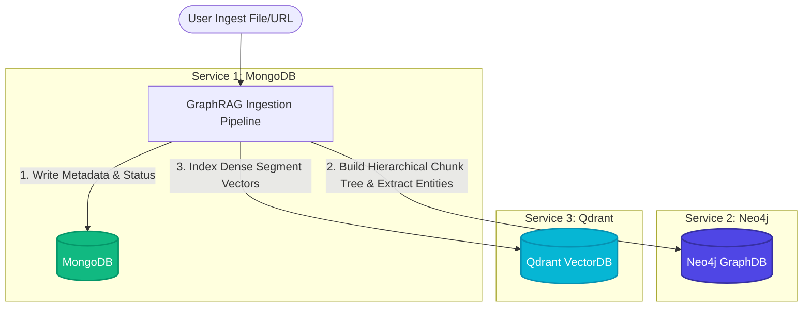
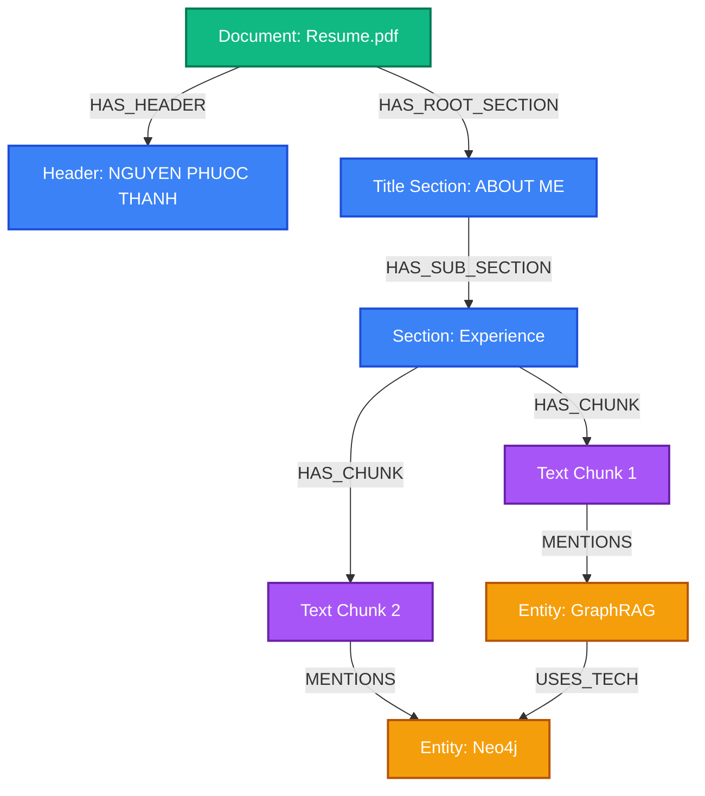

# 🧠 Layout-Aware Multimodal Ingestion & Hierarchical GraphRAG Engine

This document details the advanced engineering principles behind InsightNote's multimodal document pipeline, layout-aware coordinate parsing using **MinerU**, and the **Hierarchical Chunking Graph** model spanning three decoupled data services.

---

## 🏗️ 1. Tri-Service Decoupled Data Architecture

InsightNote splits data management into three specialized services, ensuring horizontal scalability and optimal data representations:



### The 3 Core Services:
1.  **MongoDB (Document Metadata & Lifecycle Store)**:
    *   Tracks files, crawler statuses, and the progressive pipeline jobs (`processing` ➔ `ready`).
    *   Saves raw text content and granular OCR parameters, shielding the relational databases from heavy document binary metadata.
2.  **Neo4j / DozerDB (Property Graph & Hierarchical Knowledge Database)**:
    *   Constructs the **parent-child Hierarchical Chunk Tree** representing layout structures.
    *   Stores semantically extracted **Entity Nodes** and **Relationship Links** connected directly to the specific text chunk where they were found (establishing absolute provenance).
3.  **Qdrant (Dense Vector Search Index)**:
    *   Indexes high-dimensional chunk embeddings (1536-D).
    *   Supports vector-similarity queries over the layout-aware segmented chunks, mapping back to Neo4j node IDs during retrieval.

---

## 📐 2. Layout-Aware Parsing via MinerU (Bbox Coordinates)

Standard RAG architectures use naive character-count sliding windows to slice text (e.g., 500-character flat chunks). This brute-force cutting breaks sentences, splits tables, and completely discards visual cues (headers, titles, and layout groupings).

InsightNote utilizes **MinerU**, an advanced multimodal document layout analyzer, to parse structural elements with sub-pixel **Bounding Box Coordinates (`bbox`)**:

```json
{
  "type": "header",
  "bbox": [0.452, 0.064, 0.96, 0.093],
  "angle": 0,
  "content": "NGUYEN PHUOC THANH"
}
```

### How Sub-Pixel Coordinates Work:
*   The bounding box (`bbox`) is represented as normal-normalized coordinates: `[x_min, y_min, x_max, y_max]`, ranging from `0.0` to `1.0` relative to page dimensions.
*   **Structural Parsing**: Blocks are automatically categorized as:
    *   `header` / `footer`: Discarded from standard chunk text to avoid index noise, but saved in metadata.
    *   `title` / `section_heading`: High-priority nodes used to partition the document into sections.
    *   `text`: Standard text chunks containing narrative paragraphs.
    *   `table` / `figure`: Handled as distinct markdown tables/captions with coordinate coordinates, preserving table structure.

---

## 🌳 3. The Hierarchical Chunking Graph Model

Using coordinates and visual categories, the pipeline constructs a **Hierarchical Tree** inside Neo4j. This tree model connects visual layout hierarchies directly to semantic knowledge:



### Why Hierarchical Graphs are superior to Flat RAG:
1.  **Context Preservation**: Chunks are never isolated. A text paragraph (`Chunk1`) is linked back to its parent section heading (`ABOUT ME`), which is linked to the active `Document`. When Qdrant retrieves `Chunk1`, Neo4j can traverse upwards (`<-[:HAS_CHUNK]-`) to pull the section header context, ensuring the LLM understands exactly what topic is being discussed.
2.  **Multi-Granular Retrieval**: The system can retrieve high-level sections (broad summaries) or narrow paragraph chunks (specific details) depending on the query's abstraction level.
3.  **Precise Traversal (No Hallucinations)**: The graph connects structural chunk nodes to semantic entity nodes. When a query seeks relationship paths, the LLM travels along actual document hierarchies (e.g., `Document ➔ Section ➔ Chunk ➔ Entity ➔ Relationship`), guaranteeing absolute citation groundedness.

---

## ⚡ 4. The Processing Sequence: Coordinate to Graph

1.  **File Upload**: The user uploads a multimodal PDF.
2.  **Layout Analysis (MinerU)**: The parser reads layout blocks, generating coordinate bounding boxes (`bbox`) and visual categories (`header`, `title`, `text`).
3.  **Coordinate Sorting & Chunking**: Blocks are sorted vertically and horizontally based on coordinate overlays. Overlapping blocks or unified columns are grouped into semantic paragraphs.
4.  **Graph Construction (Neo4j)**:
    *   Creates parent `Document` node.
    *   Creates `Header` and `Title` nodes.
    *   Generates `Chunk` text nodes with coordinate property arrays `[x_min, y_min, x_max, y_max]` saved in their properties.
    *   Draws `[:HAS_PARENT]` and `[:HAS_CHILD]` relations between sections.
5.  **Vector Sync (Qdrant)**: Embeddings are calculated for each chunk and synced to Qdrant, linking Qdrant point IDs to the Neo4j `Chunk` node IDs.
6.  **Entity Linking**: Semantic LLM extraction isolates entities (e.g., people, technologies) and draws `[:MENTIONS]` edges from `Chunk` nodes to `Entity` nodes in Neo4j.
