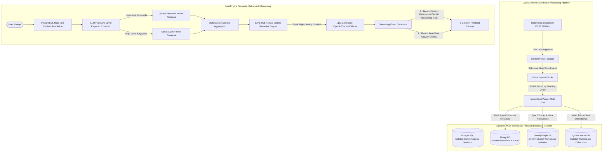

# 🌲 Multi-Workspace GraphRAG Engine Architecture (RAG_ARCHITECTURE.md)

Welcome to the architectural core of **InsightNote**—the next-generation **Multi-Notebook GraphRAG Knowledge Workspace**. 

Unlike standard "ChatPDF" clones that perform naive character splitting and lose all layout, structural, and semantic context, InsightNote models documents as highly structured **Hierarchical Knowledge Trees** linked to a **Multi-Turn Reasoning Graph**.

By orchestrating **Neo4j** (GraphDB), **Qdrant** (Vector DB), **MongoDB** (Metadata Store), and **PostgreSQL** (Chat History) on a per-workspace basis, the system delivers absolute citation groundedness, zero hallucinations, and dynamic interactive graph-highlighted responses.

---

## 🎨 Core Architectural Blueprint

Here is how InsightNote’s **Layout-Aware Coordinate Processing Pipeline** ingests documents, extracts complex knowledge networks, and stores them securely under isolated multi-workspace databases:

---

## 💎 Premium Technology Highlights

### 🚀 1. Dynamic Multi-Workspace Physical Isolation
InsightNote features **enterprise-grade workspace isolation** for its Multi-Notebook architecture. When you switch notebooks or spin up a new workspace:
*   **Vector Isolation**: Qdrant collections are created dynamically with the active `notebook_id` as the namespace prefix.
*   **Graph Isolation**: All Nodes and Relationships written to Neo4j are dynamically prefixed and queries are isolated using a designated **Workspace Node Label** (`workspace_label = self._get_workspace_label()`), ensuring no cross-notebook graph leakage.
*   **Metadata Isolation**: MongoDB databases or collections are isolated by workspace tracking IDs.
*   **Conversational Isolation**: PostgreSQL hosts isolated chat histories where `notebook_conversations` dynamically map message histories exclusively under the corresponding `notebook_id`.

### 📄 2. Layout-Aware Parsing & Coordinate Tracking
Standard RAG systems treat PDFs as plain text strings, breaking tables, formulas, and section structures. InsightNote uses **MinerU** to perform multimodal layout-aware extraction:
*   **Bounding Boxes (`bbox`)**: Structures are extracted as `[x_min, y_min, x_max, y_max]` coordinates, allowing the user to view exactly which visual segment of the page a citation points to.
*   **Hierarchical Chunking**: Sections are mapped as hierarchical parent-child nodes inside Neo4j (e.g., `Document ➔ Title Section ➔ Sub-Section ➔ Paragraph Chunk`). If a paragraph chunk matches a vector query, the RAG engine traverses *upwards* in Neo4j to retrieve the parent header, providing the LLM with pristine section-level context and completely preventing hallucinations.

### 🔗 3. Entity-Relationship Interlocking Graph
During ingestion, an LLM pipeline extracts **Semantic Entities** (e.g. people, places, organizations, policies) and **Meticulous Relationships** from the text:
*   These nodes are written into Neo4j with weight metrics and descriptions.
*   They draw `[:MENTIONS]` edges directly back to the source coordinate chunk, creating a perfect interlocking matrix.
*   This forms the basis for **Pillar 3: The WebGL 3D Force-Directed Graph**, allowing live interactive navigation of the entire document's semantic structure.

### 🧠 4. Dual-Engine Retrieval with Advanced Reranking
When you ask a question over your Notebook:
1.  **Multi-Turn Resolution**: The system queries PostgreSQL (`chat_history_db`) to fetch the last 10 conversational turns, formatting them to resolve follow-up questions contextually.
2.  **Keyword Extraction**: The LLM analyzes the conversation and splits keywords into **High-Level** (for themes and relationships) and **Low-Level** (for specific facts and definitions).
3.  **Hybrid Retrieval**: 
    *   Qdrant performs dense vector retrieval based on low-level keywords.
    *   Neo4j runs Cypher traversals based on high-level keywords, pulling connected entity-relation subgraphs.
4.  **Premium Rerank Filtration**: All retrieved candidates (chunks, entities, relationships) are evaluated using a cross-encoder model (**BAAI/bge-reranker-v2-m3**, **Jina AI**, or **Cohere**). It scores and re-orders the items, retaining only the highest density contexts to avoid exceeding the LLM's context window.

### ⚡ 5. Double-Payload EventStream Protocol
Instead of making the user wait for the entire generation, our FastAPI router utilizes an asynchronous EventStream generator:
*   **Payload 1 (Metadata)**: Instantly returns a JSON block containing all citation objects (`CitationItem`), the precise bounding-box coordinates, retrieval metrics, and the **WebGL Reasoning Path** (`graph_path` of traversed node and link IDs). The 3D graph panel listens to this and immediately illuminates the active reasoning chain with floating energy particles.
*   **Payload 2 (Tokens)**: Streams the response tokens dynamically, rendering markdown with zero latency.

---

## 🧭 Four Versatile Query Modes

InsightNote supports four distinct query modes tailored to different types of analysis:

| Mode | Core Engine | Best For | Description |
| :--- | :--- | :--- | :--- |
| **`mix`** | **Vector + Graph (Unified)** | General Workspace Q&A | Fetches dense vector chunks and traverses adjacent Neo4j entities. Highlights the reasoning path on the 3D WebGL graph. |
| **`hybrid`** | **Multi-dimensional Context** | Deep Cross-Reference | Merges global relational patterns with local entity details using an optimized round-robin retrieval. |
| **`local`** | **Deep Entity Retrieval** | Specific Fact Retrieval | Focuses tightly on extracted semantic entities and their immediate coordinates and chunks. |
| **`global`** | **Thematic Cypher Traversal** | Structural Analysis | Evaluates high-level themes across the entire notebook by querying global relationships in the graph. |
| **`naive`** | **Dense Vector Only** | Standard Search | Standard semantic search over Qdrant. Automatically triggers as a fallback if the Graph Database is offline, guaranteeing high availability. |

---

## 🛠️ Tech Spec Summary

*   **Multimodal Parser**: MinerU (layout extraction, LaTeX support, table markdown reconstruction).
*   **Vector Engine**: Qdrant (high-performance semantic similarity).
*   **Graph Engine**: Neo4j / DozerDB (Cypher query language, full-text CJK index support).
*   **Metadata & Cache**: MongoDB (lifecycle tracking and cache saving).
*   **Conversational Memory**: PostgreSQL (isolated sessions and cascade message deleting via asyncpg).
*   **Reranking**: BAAI BGE-Reranker-M3, Jina AI, Cohere, or Google Vertex Rerankers.
