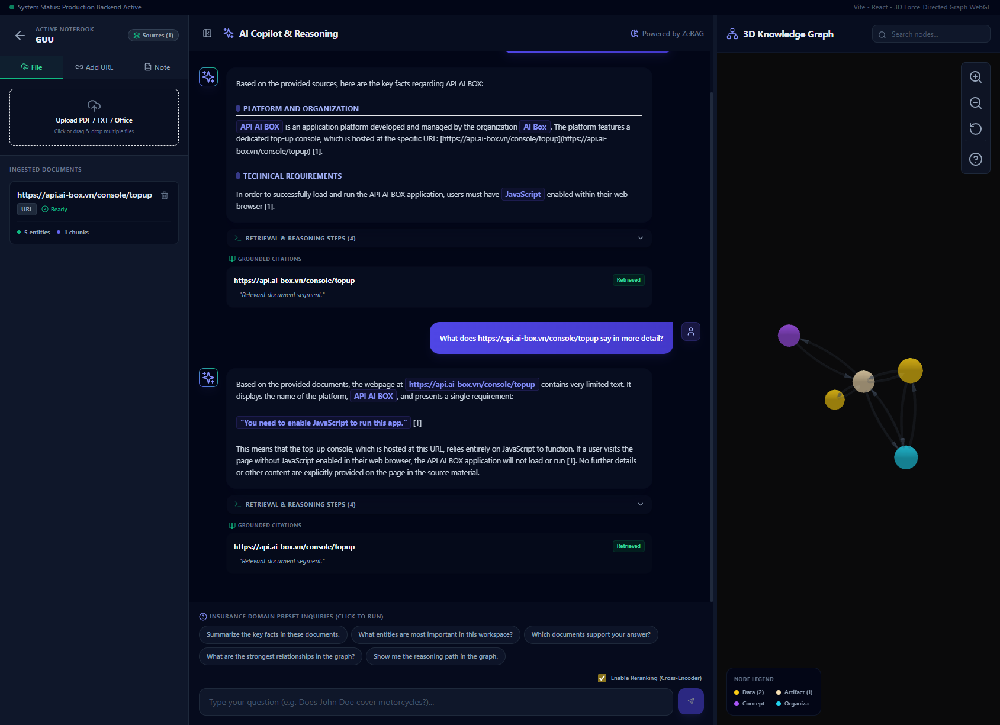
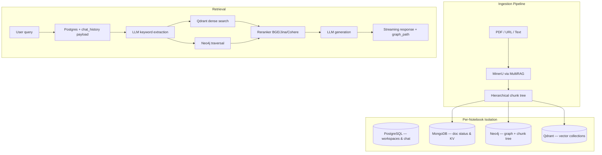

# RAG Architecture

Core architecture of the InsightNote multi-notebook GraphRAG engine (ZeRAG + MultiRAG).



---

## System overview

InsightNote models documents as **hierarchical knowledge trees** with layout coordinates, stored across four databases with per-notebook isolation.



---

## Multi-workspace isolation

Each notebook gets isolated storage:

| Database | Isolation mechanism |
|---|---|
| **PostgreSQL** | `notebook_workspaces`, `notebook_conversations`, `active_jobs` tables keyed by `notebook_id` |
| **MongoDB** | Collection prefix `{notebook_id}_*` |
| **Qdrant** | Collection namespace per notebook |
| **Neo4j** | Dynamic workspace label on all nodes/relationships |

Deleting a notebook cascades: Postgres rows, Mongo collections, Qdrant namespace, and Neo4j nodes matching the workspace label.

Implementation: `get_rag_instance()`, `purge_mongo_collections()`, and delete handlers in `insightnote_routes.py`.

---

## Database fallback tiers

| Tier | Databases online | Behavior |
|---|---|---|
| **Minimum** | PostgreSQL + MongoDB | Notebook CRUD, doc status, chat history work; graph/vector features degrade |
| **Maximum** | All four | Full GraphRAG: ingest, hybrid retrieval, 3D graph, grounded citations |
| **Offline** | None / backend down | Frontend sandbox via `mock-data.ts` |

Startup never crashes on DB failure — warnings are logged and degraded mode continues.

---

## Ingestion pipeline

1. **Enqueue** — file/URL/note registered in Postgres `active_jobs` + Mongo doc status
2. **Parse** — MultiRAG with MinerU extracts layout blocks with `bbox` coordinates
3. **Chunk** — hierarchical parent-child tree (see [CHUNKING.md](CHUNKING.md))
4. **Extract** — entities and relationships written to Neo4j
5. **Embed** — text chunks indexed in Qdrant (dimension depends on embedding model)
6. **Ready** — job status transitions to `ready`; frontend highlights new graph nodes in emerald

### Pipeline progress steps (API)

**PDF / file upload:**
- `load_file` → `document_understanding` → `vector_graph_sync`

**URL / text note:**
- `load_file` → `chunking` → `entity_extraction` → `vector_graph_sync`

Polled via `GET /api/pipeline/jobs/{job_id}`.

---

## Dual retrieval engine

Default mode: **`mix`** — combines Qdrant vector search and Neo4j graph traversal, then reranks with a cross-encoder.

Response includes:
- `answer` — LLM-generated text
- `citations` — grounded source chunks
- `retrieval_steps` — human-readable audit log
- `graph_path` — `{ node_ids, link_ids, mode: "query" }` for 3D highlight

See [QUERY.md](QUERY.md) for all query modes.

---

## Asyncio concurrency

LLM rate limiters use **lazy initialization** of `asyncio.Lock`, `PriorityQueue`, and `Event` inside the running event loop — avoiding the classic error:

```
got Future attached to a different loop
```

This allows parallel ingestion of many files without queue freezing.

---

## Optimized graph queries during ingest

Full-graph scans are avoided during progressive indexing. Targeted Cypher restricts to active document IDs:

```cypher
MATCH (n:`{workspace_label}`) WHERE n.source_id IN $doc_ids RETURN n
```

---

## Configuration reference

All settings: **`backend/config/config.yaml`** + **`.env`**

Setup guide: **[../../docs/SETUP.md](../../docs/SETUP.md)**

```yaml
storage:
  kv: "MongoKVStorage"
  graph: "Neo4JStorage"
  vector: "QdrantVectorDBStorage"
  doc_status: "MongoDocStatusStorage"
```

---

## Related docs

- [MULTIMODAL_PARSING.md](MULTIMODAL_PARSING.md) — MinerU element types
- [CHUNKING.md](CHUNKING.md) — bbox sorting & Neo4j tree
- [QUERY.md](QUERY.md) — query modes & chat history
- [../frontend/docs/API_CONTRACT.md](../../frontend/docs/API_CONTRACT.md) — REST API
