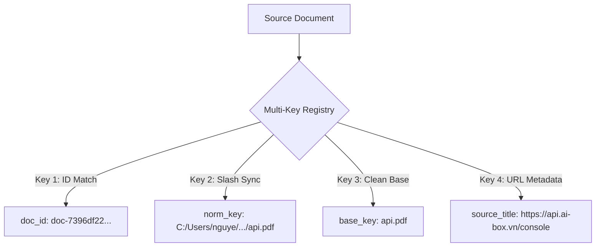

# 📜 Grounded Citations & Progressive Reasoning Specification

This specification document details the design and implementation of InsightNote's core **Grounded Citation** mechanics, the **Multi-Key Bulletproof Path Matching** system, and the **Progressive Retrieval Log** console. It outlines how the system guarantees absolute semantic context truth, links vector-chunks directly to sub-pixel coordinates, and renders an interactive terminal-style reasoning UI.

---

## 🚫 1. Solving LLM Hallucinations via Coordinate Linking

Standard RAG systems present answers with inline references, but clicking them only points to a general PDF document name. If the document is 200 pages long, the user still suffers from information fatigue.

InsightNote solves this by linking **Qdrant Vector Points** directly to **Neo4j Bbox Coordinates**:

```txt
┌──────────────────┐     ┌────────────────────┐     ┌────────────────────┐
│ Qdrant Dense     │     │ Neo4j Chunk Node   │     │ Frontend PDF       │
│ Vector Search    ├────➔│ (Retrives page num │────➔│ Highlight Overlay  │
│ (Top-k similarity│     │ & bbox coordinates)│     │ (Draws red box on  │
│ chunk matching)  │     │                    │     │ exact page region) │
└──────────────────┘     └────────────────────┘     └────────────────────┘
```

### The Provenance Chain:
1.  **Vector Match**: Qdrant identifies the highest-scoring text segment based on semantic vector similarity.
2.  **Topological Lookup**: Neo4j resolves the segment's Node ID, pulling:
    *   `content`: The raw text string.
    *   `page_number`: The exact physical page index where the paragraph resides.
    *   `bbox`: The MinerU visual bounding box array `[x_min, y_min, x_max, y_max]`.
3.  **Grounding Delivery**: The FastAPI router wraps these variables inside a `CitationItem` response array.
4.  **UI Render**: The chat panel displays **Citation Cards** below the answer, showing the exact source document title, page, similarity percentage score, and text snippet. Clicking the card triggers the PDF viewer to open the exact page and draw a semi-transparent red highlight overlay matching the `bbox` boundaries!

---

## 🛡️ 2. Multi-Key Bulletproof Path Matching (Windows Path-Slashes Sync)

One of the most complex challenges in multi-tier RAG systems is linking retrieved citations (which might be crawled URLs or local PDF file references) back to their original user-friendly titles or source addresses without exposing local directories.

On **Windows Environments**, paths often use backslashes (`\`, e.g., `C:\Users\nguye\...\https___api.ai-box.vn_console.pdf`) in the persistent database, while the python asyncio RAG engine or Qdrant vector database returns forward slashes (`/`). Additionally, some queries return absolute paths while others return relative paths.

To resolve this, InsightNote utilizes a **Multi-Key Bulletproof Matching** algorithm inside `insightnote_routes.py` to index each document under four distinct keys:



### Path-Mapping & Citation Resolution Flow:
*   **Step 1: Database Enqueue**: When crawling a URL, the original target address is preserved in the MongoDB `metadata.url` field, while the document file name is normalized (e.g. `api_ai-box_vn_console.pdf`).
*   **Step 2: Dictionary Indexing**: During a chat query, `source_titles_by_path` is built by reading all active notebook sources. For each source, its `source_title` is set to its `metadata.url` (if it's a crawled URL), or its basename (if it's a PDF). This title is then mapped to four separate keys:
    1.  The unique MongoDB `doc_id` (e.g., `doc-7396df22...`).
    2.  The `normalized_path` (where all `\` are replaced with `/`).
    3.  The lowercase `basename` (e.g., `https___api.ai-box.vn_console.pdf`).
*   **Step 3: Citation Title Resolution**: When `_citation_title_from_reference` is called to render a citation card, it queries the dictionary sequentially. By prioritizing the **`doc_id`** first, it instantly matches the MongoDB document ID and returns the beautiful original URL (with `https://` prefix) as the citation title, bypassing generic fallback strings.

---

## 🔒 3. Absolute ID Redaction & Log Sanitization (Privacy Layer)

To maintain a premium aesthetic and prevent exposing sensitive server directories or database structures, InsightNote implements a rigorous, regex-based privacy layer (`_sanitize_string` in the backend):

1.  **Redacting Database Identifiers**: Automatically detects and strips raw database hashes like `doc-`, `chunk-`, `track-`, `src_`, `job_`, and `d-id:` prefixes from any progress messages before sending them to the UI.
2.  **Path Trimming**: Windows-style and Unix-style absolute paths are automatically captured by regular expressions and stripped down to their clean, base filenames using `os.path.basename`.
3.  **Metadata Hiding**: Removes raw JSON strings and parameters like `metadata={...}` from the log streams, ensuring the UI progressive logs remain completely readable, polished, and human-friendly.

---

## 🛠️ 4. Collapsible Progressive Reasoning (Terminal Console)

To build user trust in corporate and legal applications, the AI must explain *how* it arrived at its conclusion.

The middle chat panel features a collapsible **Retrieval & Reasoning Steps** console styled as an interactive, dark terminal window:


### The Logs Generation Loop:
*   During retrieval, the ZeRAG engine logs each milestone inside a Python string array (e.g. key extraction, similarity parameters, Cypher traversal queries, reranking outputs).
*   This array is delivered via the `retrieval_steps` response field.
*   The **`ChatPanel.tsx`** renders these steps inside an expandable, monospace shell. Clicking the header toggles a smooth Framer Motion height transition, giving users a complete audit trail of the RAG engine's internal cognitive process.

---

## 🎨 5. Premium Conversational UI Elements

The chat experience is enhanced by a suite of premium visual cues designed to mimic real-time human-like reasoning:

### 3-Dot Bouncing Pending Bubble
When a question is submitted, instead of a rigid full-page placeholder skeleton, a compact assistant-styled bubble appears containing three bouncing dots. The dots use Tailwind's `animate-bounce` with staggered animation delays (`[animation-delay:-0.3s]`, `[animation-delay:-0.15s]`, etc.) to create a smooth, buttery wave effect that indicates active processing.

### Inline Pulsing Streaming Cursor
During active text streaming, a sleek, pulsing cursor block (`Cursor` component styled as an inline-block pulsing indigo bar) is appended precisely to the last line of the rendered text inside the `MarkdownRenderer`. As soon as the streaming finishes, the cờ `isStreaming` transitions to `false` and the cursor is immediately removed, leaving a perfectly clean output bubble.
