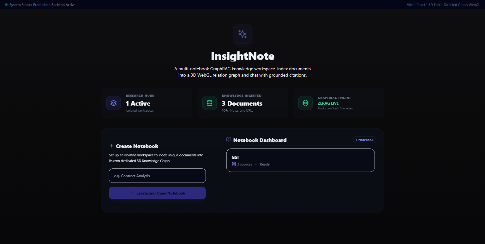
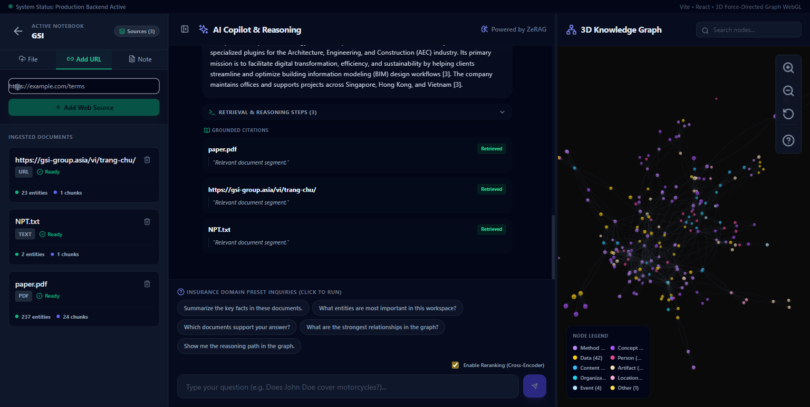
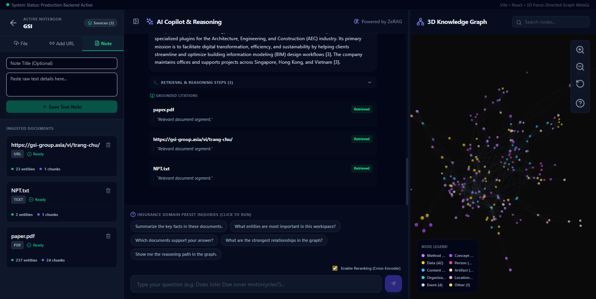

# 🎨 Frontend Development Guide (DEVELOPMENT_GUIDE.md)

This document serves as the comprehensive architectural reference for the InsightNote **Vite + React + TypeScript + Tailwind** client-side application. It details state coordination, non-blocking ingestion concurrency, WebGL 3D Graph rendering optimizations, and the dynamic sandbox fallback system.

---

## 📂 1. Project Directory Structure

```txt
frontend/src/
├── App.tsx                     # Central State Hub & Ingestion Orchestrator
├── main.tsx                    # React DOM Mounting & Global Configurations
├── index.css                   # Tailwind CSS Directives & Custom Keyframe Animations
├── components/
│   ├── sources/SourcesPanel.tsx # Ingest controls, Notebook switcher, & Progressive Log viewer
│   ├── chat/ChatPanel.tsx       # Markdown renderer, Pulsing Streaming Cursor, & Citation cards
│   └── graph/KnowledgeGraphPanel.tsx # react-force-graph-3d, Auto-rotate, & Triple-Lock Shaders
└── lib/
    ├── api.ts                  # Standard Asynchronous Fetch Broker & Sandbox Fallbacks
    ├── mock-data.ts            # High-fidelity mock databases (Insurance & Resume domains)
    └── types.ts                # Shared TypeScript Interface Definitions
```

---

## 🏠 2. State Coordination & Main Dashboard (`App.tsx`)

InsightNote implements a strict **unidirectional data-flow** architecture. The core application state is centralized in `App.tsx`, which serves as the broker for all child pillars.



### State Ownership Map:
*   `notebooks`, `activeNotebook`: Controls active workspace selections and the main dashboard view.
*   `sources`, `pipelineJobs`: Tracks currently ingested document lists and registers active progressive index tasks.
*   `messages`, `chatLoading`: Feeds the conversational stream in the chat window.
*   `graphData`, `highlightPath`: Holds coordinates of nodes and links mapped dynamically on the 3D canvas.

---

## ⚡ 3. Non-Blocking Concurrent Ingestion (Sources Panel)

In older versions, the ingestion forms would lock (become `disabled`) during file uploads, URL scraping, or note creation. InsightNote v1.1.0 completely unblocks this pipeline to support **unlimited concurrent parallel ingestion**.




### Architectural Design for Parallel Ingestion:
1.  **Instant Synchronous Form Clearing**: Submit handlers (`handleUrlSubmit`, `handleTextSubmit`, `handleFileChange`) immediately wipe the inputs and clear the forms synchronously, leaving them ready for the next submission instantly with zero user-blocking lag.
2.  **Unawaited Background Promises**: The parent callbacks (`onAddUrl`, `onAddText`, `onUploadFile`) are invoked as unawaited background promises (`void ...`). This spawns separate, independent asynchronous network request cycles.
3.  **Dynamic Progressive Trackers**: Each parallel task generates a unique `tempSourceId` and enters the sidebar list as an active `"processing"` card. The card spawns its own isolated, real-time polling loop via `/api/pipeline/jobs/{job_id}` to retrieve progressive index states.

---

## 💬 4. Conversational Q&A & Streaming Cursor (`ChatPanel.tsx`)

The central middle column renders reasoning answers using custom Markdown syntax parsers, collapsible terminal steps, and synchronized citaion cards.


### High-Fidelity UI Innovations:
*   **Bouncing Dots Pending State**: During the initial "AI is reasoning..." phase, a compact bubble containing 3 pulsing dots (`animate-bounce` with staggered `animation-delay` offsets) is rendered to indicate active cogitation.
*   **Inline Pulsing Streaming Cursor**: If `isStreaming` is true, a sleek, pulsing indigo cursor (`Cursor` block) is dynamically appended to the end of the last paragraph. It automatically removes itself immediately upon stream completion.
*   **Anti-Duplicate Citation Splicing**: The `MarkdownRenderer` automatically strips any raw bibliography references or footnotes at the bottom of the LLM text output, preventing visual clutter because citations are already elegantly displayed as rich interactive cards below the answer.

---

## 🌐 5. WebGL 3D Graph Optimization (`KnowledgeGraphPanel.tsx`)

InsightNote’s 3D Knowledge Graph is built using WebGL and Three.js. It features smooth camera orbits, undirected neighbor expansion, and **stuck-particles dập tắt (Triple-Lock Safety)**.

### The Triple-Lock Stuck Particle Fix:
React-force-graph-3d caches line geometries to maintain high-performance rendering. If a relationship's directional particles are modified, old in-flight particles may remain stuck on the screen. To prevent this, the graph panel enforces:
1.  **Lock 1 (Particles Count)**: Sets count to `0` unless `hasActiveHighlight` and `link.width > 1.5` are true.
2.  **Lock 2 (Particles Width)**: Sets particle visual width explicitly to `0` for inactive links.
3.  **Lock 3 (Particles Speed)**: Sets particle flow velocity to `0` to instantly stop any lingering render ticks.
4.  **Imperative Scene Refresh**: On any highlight change, we call `fgRef.current.refresh()` to force Three.js to completely flush the cache and redraw the links.

---

## 🌿 6. Local Sandbox Fallbacks & Offline Simulation

To guarantee an absolute, crash-free presentation even if databases (MongoDB, PostgreSQL, Neo4j, Qdrant) are down or unreachable, the system automatically falls back to offline simulation mode:

*   `api.ts` catches connection failures and gracefully returns mock arrays.
*   `localNotebooks` is empty by default when PostgreSQL is connected, ensuring a clean production dashboard. If PostgreSQL is offline, `listNotebooks()` gracefully falls back to returning designated demo notebooks.
*   `getGraph()` transparently serves `MOCK_NODES_RESUME` or `MOCK_NODES_INSURANCE` only for demo environments, keeping newly created notebooks completely pristine.
